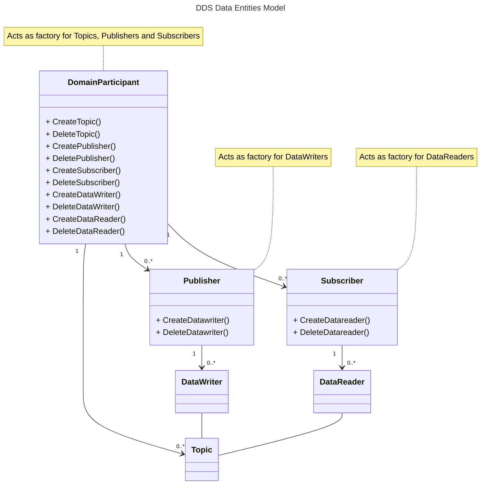

# DDS (Data Distribution System) Core Concepts

## Introduction
Data Distribution Service (DDS) is a middleware technology that enables efficient and 
reliable data communication and integration among distributed applications. It provides a data-centric publish-subscribe
model for real-time and scalable data distribution.

DDS is designed to address the challenges of real-time systems, where data needs to be shared among multiple components
or applications in a distributed environment. It offers a standardized approach for data communication,
ensuring timely delivery, scalability, and interoperability.

This article aims to provide an overview of key concepts and features of DDS, including Data-Centric Publish-Subscribe,
Quality of Service Policies, Extensible Transport Framework, DDS Discovery, DDS Domains, DDS Entities, and the OpenDDS
underlying native layer used by OpenDDSharp.

## Data-Centric Publish-Subscribe (DCPS)
The Data-Centric Publish-Subscribe (DCPS) model is at the core of the Data Distribution Service (DDS) technology.
DCPS provides a flexible and scalable approach to data distribution by decoupling data producers (publishers) from
data consumers (subscribers). This decoupling allows publishers and subscribers to interact without direct knowledge
of each other, resulting in a highly modular and loosely coupled system architecture.

DDS provides a rich set of features to support DCPS, including content-based filtering, temporal decoupling,
and support for large-scale systems with thousands of participants.

### DCPS Key Concepts

To understand DCPS, it's essential to grasp the following key concepts:

#### Topic
A topic represents the type of data being published or subscribed to within the DDS system.
It defines the structure and semantics of the data. Publishers and subscribers connect to a topic to exchange
data samples.

#### Publications and Subscriptions
Publishers publish data samples on a specific topic, and subscribers express their interest in receiving data from
specific topics. The decoupling between publishers and subscribers allows for dynamic and flexible data exchange.

A DataWriter is associated with a publisher and is responsible for sending data samples to the system.
It encapsulates the data, applies Quality of Service (QoS) policies, and sends the data over the network.
DataWriters are associated with a specific topic and can send multiple data samples.

A DataReader is associated with a subscriber and receives data samples from the system.
It filters and processes the received data according to the subscriber's interests and QoS policies.
DataReaders are associated with a specific topic and can receive multiple data samples.

#### Data Sample
A data sample is a unit of data that is sent by a publisher and received by one or more subscribers.
Data samples are associated with a specific topic and encapsulate the data values defined by the topic's data structure.

#### Quality of Service (QoS) Policies
QoS policies provide fine-grained control over various aspects of data distribution.
Publishers and subscribers can define QoS policies to influence data delivery, reliability, durability,
deadline enforcement, and other characteristics. QoS policies enable applications to specify their requirements and
preferences for data communication. QoS policies cover various aspects such as reliability, durability, deadline, liveliness,
and resource limits. By defining appropriate QoS policies, applications can ensure that their data is communicated
reliably and efficiently.

DDS provides a wide range of QoS policies to meet different application requirements.
These policies can be set at various levels, including domain participant, topic, and data writer/data reader levels.

### DCPS Workflow

The DCPS workflow consists of the following steps:

1. **Topic Definition:** Topics are defined to specify the data structure and semantics
of the information being exchanged. Topics provide a shared understanding between publishers and subscribers.
2. **Publisher Setup:** Publishers create DataWriters associated with the desired topics.
DataWriters encapsulate the data samples, apply QoS policies, and publish them to the DDS system.
3. **Subscriber Setup:** Subscribers create DataReaders associated with the desired topics.
DataReaders filter the received data based on subscriber interests and QoS policies.
4. **Data Exchange:** Publishers send data samples through their DataWriters, which are received by the DDS system.
The DDS system then delivers the data samples to the relevant DataReaders based on their subscriptions and interests.
5. **Data Processing:** Subscribers process the received data samples according to their application logic.
This processing can include analysis, visualization, storage, or any other desired action.

### Benefits of DCPS

The DCPS model provides several benefits for distributed systems:

- **Loose Coupling:** Publishers and subscribers do not require direct knowledge of each other, enabling them to evolve independently.
- **Modularity:** DCPS promotes modular design by decoupling data producers from consumers, allowing for easier system integration and evolution.
- **Scalability:** The publish-subscribe model scales well, as data distribution is decoupled from the number of publishers and subscribers.
- **Flexibility:** Publishers and subscribers can dynamically join or leave the system without affecting other components.
- **Efficiency:** DCPS optimizes data distribution by utilizing efficient filtering, content-based routing, and data transformation

## Extensible Transport Framework (ETF)
The Extensible Transport Framework (ETF) in DDS allows for pluggable transport protocols, enabling DDS to work over
different network technologies. The ETF provides an abstraction layer that separates the DDS core from the underlying
transport implementation, allowing for flexibility and extensibility.

DDS supports various transport protocols out of the box, such as TCP/IP, UDP/IP, Shared Memory,
and Real-Time Publish-Subscribe (RTPS) over different network interfaces.
Additionally, developers can extend the ETF to integrate DDS with custom or proprietary network technologies.

## DDS Discovery
DDS Discovery is the mechanism by which participants in a DDS system can discover and establish communication with
each other. During the discovery process, participants exchange information about their capabilities and data
communication requirements. This enables the dynamic formation and maintenance of data communication channels.

DDS supports both static and dynamic discovery. Static discovery involves explicitly configuring participants,
while dynamic discovery allows participants to discover each other automatically based on predefined discovery protocols.

DDS employs a discovery mechanism to facilitate the automatic discovery and configuration of DDS entities within a
distributed system. The discovery process allows publishers and subscribers to find each other dynamically without
manual configuration or centralized coordination. DDS discovery enables the seamless integration of new components into
a DDS system and supports dynamic reconfiguration.

### Key Concepts

To understand DDS discovery, it is important to be familiar with the following key concepts:

#### Participant
A participant represents an application or component within a DDS domain. It acts as an entry point for DDS entities
and manages the discovery process. Each participant has a unique identifier and
is responsible for advertising its presence and discovering other participants in the system.

### Topics and Data Readers/Writers
DDS entities, such as DataReaders and DataWriters, are associated with specific topics. Topics provide a logical 
grouping of related data and define the structure and semantics of the information being exchanged. 
Participants discover topics and the associated DataReaders/Writers to establish communication.

### Discovery Data
Discovery data refers to the information exchanged during the discovery process.
It includes participant metadata, topic descriptions, and QoS policies. Discovery data allows participants
to advertise their capabilities and interests and enables others to discover and connect with them.

### Static and Dynamic Discovery
DDS supports both static and dynamic discovery mechanisms. Static discovery involves configuring participants and
their relationships manually using configuration files or scripts. Dynamic discovery, on the other hand, enables
participants to discover each other dynamically at runtime based on predefined discovery protocols.

### Discovery Process

The DDS discovery process typically involves the following steps:

1. **Participant Creation**: Participants are created by applications or components within a DDS domain.
Each participant is assigned a unique identifier and configured with its QoS policies and discovery settings.

2. **Advertisement**: Participants advertise their presence and capabilities by publishing their
participant metadata and topic descriptions. This information includes details such as participant name,
QoS policies, supported topics, and associated DataReaders/Writers.

3. **Discovery**: Other participants in the system, actively or passively, discover and subscribe
to the published participant metadata and topic descriptions. Discovery protocols ensure that 
participants can find and establish connections with the desired topics and their associated DataReaders/Writers.

4. **Connection Establishment**: Once a participant discovers the relevant topics and DataReaders/Writers,
it establishes connections with the corresponding participants. These connections allow for the exchange
of data between publishers and subscribers.

### Benefits of DDS Discovery

DDS discovery provides several benefits for distributed systems:

- **Automatic Configuration**: Discovery eliminates the need for manual configuration of DDS entities, simplifying
the setup process and reducing the potential for human error.

- **Dynamic System Evolution**: Discovery allows for dynamic system reconfiguration and
component addition or removal without disrupting the overall system operation. New participants can join the
system seamlessly, and existing participants can adapt to changes.

- **Scalability**: DDS discovery scales well, even in large distributed systems with a high number of participants
and topics. The discovery process efficiently manages the network traffic and ensures efficient and timely
discovery of relevant entities.

- **Flexibility**: Discovery enables participants to dynamically adapt to changing network conditions,
failures, or reconfigurations. It provides the necessary flexibility to cope with evolving system requirements.

- **Interoperability**: DDS discovery is standardized, enabling DDS implementations from different vendors to
interoperate seamlessly. This promotes interoperability and enables the integration of components developed by
different parties.

Summarizing, DDS discovery is a crucial aspect of DDS technology, enabling the automatic discovery and configuration of
DDS entities within a distributed system. It allows participants to dynamically find and connect with each other based
on predefined discovery protocols. DDS discovery provides numerous benefits, including automatic configuration, dynamic
system evolution, scalability, flexibility, and interoperability.

## DDS Domains: Isolation of Data within a Network

In the context of the Data Distribution Service (DDS), a domain represents a logical partition within a DDS system.
It provides a mechanism for isolating and organizing data within a network. DDS domains offer a powerful means of
separating different components or applications, enabling them to operate independently while still facilitating
data communication when necessary.

### Key Concepts

To understand DDS domains and how they provide isolation of data within a network, it is important to be familiar with
the following key concepts:

#### Domain ID
A DDS domain is identified by a unique numeric ID. This ID is used to differentiate one domain from another within the
same network. Each DDS participant is associated with a specific domain ID, allowing it to operate within that domain.

#### Partition
A partition is a logical grouping mechanism within a DDS domain. Participants and topics can be associated
with one or more partitions. By associating participants and topics with specific partitions, data can be segregated
and isolated within those partitions. This enables fine-grained control over which participants and topics can
communicate with each other.

#### Data Isolation
Within a DDS domain, data isolation is achieved by separating participants into different domains and using partitions 
to further segregate data within those domains. Participants within a domain can only communicate with other
participants in the same domain or with participants in other domains explicitly configured to allow communication.
This isolation ensures that data remains contained within its intended scope and prevents unintended data leakage or
interference.

### Benefits of DDS Domain Isolation

DDS domains provide several benefits for data isolation within a network:

- **Security and Privacy**: DDS domains enable data isolation, preventing unauthorized access to sensitive information.
Participants and topics within a domain are logically separated from other domains, reducing the risk of data breaches.

- **System Organization**: Domains facilitate the organization and management of a DDS system.
By separating components into different domains, system complexity is reduced, and the overall system becomes easier to
understand and maintain.

- **Scalability**: DDS domains allow for scalability by dividing a large system into smaller,
manageable units. Each domain can independently scale and accommodate additional participants and data without
impacting other domains.

- **Fault Isolation**: By segregating data within domains, any faults or failures within a domain are contained within
that specific domain, minimizing the impact on the rest of the system. This isolation promotes system robustness
and fault tolerance.

- **Flexible Configuration**: DDS domains provide the flexibility to configure communication policies and access
controls at the domain level. This allows for fine-grained control over data communication and enables customization
to meet specific application requirements.

DDS domains provide a mechanism for isolating and organizing data within a network. By associating participants and
topics with specific domains and partitions, DDS enables the controlled exchange of data while

## DDS Data Entities Model
In DDS, entities are the key building blocks that define the communication infrastructure.
The DDS (Data Distribution Service) Entity Data Model is a conceptual representation of the entities and their
relationships within a DDS system. It provides a standardized way to define and organize the data that is communicated
and distributed using the DDS middleware.

The DDS Entity Data Model consists of several core entities that are essential for the functioning of a DDS system. 
These entities include:

1. Domain Participant:

   A domain represents a virtual space in which DDS applications operate. The domain participants act as a container
   for DDS entities and provides a scope for communication and data sharing. Multiple domains can coexist within
   a DDS system, enabling isolation and separation of data but one DomainParticipant can only belong to one domain.
   Create multiple DomainParticipants objects to join multiple domains.

   The domain participant represents an application or a logical entity that interacts with the DDS system.
   It acts as a container for other DDS entities and provides a context for data sharing.

   Each participant is associated with a unique identifier within a domain.

2. Topic:
   A topic defines the type and structure of the data that is communicated within the DDS system.

   It represents a named data type and provides a means for publishers and subscribers to express their interest in 
   specific data. Topics act as a bridge between data producers and consumers.

3. Publisher:
   A publisher is responsible for producing and sending data to the DDS system. It is associated with one or more topics
   and can publish data samples at a certain rate. Publishers are typically implemented within DDS applications
   that generate data.

4. Subscriber:
   A subscriber is responsible for receiving and consuming data from the DDS system. It expresses its interest in
   specific topics and receives data samples published by corresponding publishers. Subscribers are typically
   implemented within DDS applications that consume data.

5. DataWriter:
   A DataWriter is associated with a publisher and is responsible for sending data samples of a specific topic.
   It manages the data publication process, including serialization, reliability, and delivery semantics.

6. DataReader:
   A DataReader is associated with a subscriber and is responsible for receiving data samples of a specific topic.
   It manages the data reception process, including deserialization, reliability, and delivery semantics.

DDS entities interact with each other to establish communication channels and enable data exchange.

The following diagram illustrates the relationships between the different DDS entities and the factory methods used
for the creation of the entities.

## OpenDDS Underlying Native Layer
OpenDDS is an open-source implementation of the DDS standard. It provides a comprehensive set of libraries, tools,
and frameworks to develop DDS-based applications.

OpenDDS adheres to the OMG DDS specification and offers a rich set of features, including support for QoS policies,
discovery, and extensible transport protocols.

OpenDDS provides a C++ API and supports various platforms and operating systems.
It integrates with popular development environments and toolchains, making it easier for developers
to build DDS applications.

The OpenDDS community actively maintains and enhances the implementation, ensuring its reliability, performance,
and compatibility with the DDS standard.

OpenDDSharp has been build on top of OpenDDS and provides a .NET API for DDS by p-invoking the native OpenDDS API and
creating an IDL to C# code generator that can interact with the underlying OpenDDS native layer.

## Conclusion
This chapter has provided an overview of the core concepts and features of DDS.

Understanding the Data-Centric Publish-Subscribe model, Quality of Service policies, Extensible Transport Framework,
DDS Discovery, DDS Domains an DDS Entities, and the underlying native layer of OpenDDS will help developers effectively utilize
DDS for building distributed applications. For more detailed information and specific implementation details,
refer to the DDS documentation and resources available in internet:

- [DDS Specification](https://www.omg.org/spec/DDS/About-DDS/)
- [DDS Foundation](https://dds-foundation.org/)
- [OpenDDS Documentation](https://opendds.org/documentation.html)
