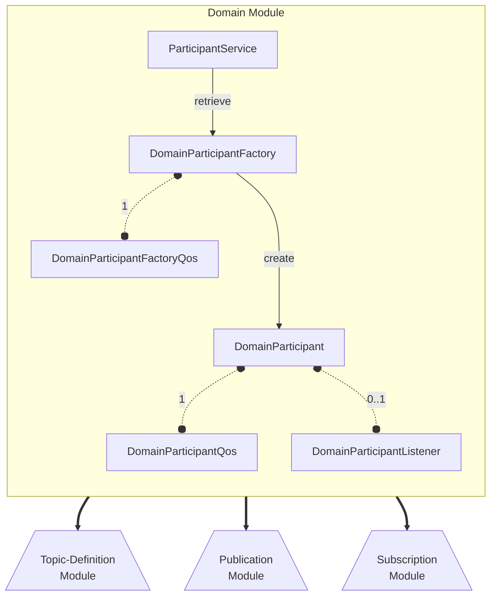

# OpenDDSharp Domain Module

## ParticipantService Class

The `ParticipantService` is singleton class in OpenDDSharp that provides the primary interface for managing
the DDS participants in your application. It allows you to obtain the `DomainParticipantFactory`, set up discovery,
and control the behavior of the DDS entities that will be created.

Being a singleton class means that there is only one instance of `ParticipantService` per application process.
This ensures that there's a centralized management entity for all `DomainParticipants` in the system.

In order to get the `ParticipantService` instance, you need to access the `ParticipantService.Instance` property.
This property returns the singleton instance of the `ParticipantService` class, which you can then use to access
the methods and properties implemented in the class.

Here's an example of how to get the `ParticipantService` instance in OpenDDSharp and call the
`GetDomainParticipantFactory()` method to retrieve a new `DomainParticipantFactory` object:

```csharp
var dpf = ParticipantService.Instance.GetDomainParticipantFactory();
```

This method consumes `-DCPS*` and `-ORB*` options and their arguments. These options are used to configure the
`DomainParticipantFactory` and its associated resources. Refer to the OpenDDS
[Run-time Configuration](https://opendds.readthedocs.io/en/latest/devguide/run_time_configuration.html)
documentation for more information on the available options and their arguments.

For example, you can use the `-DCPSConfigFile` option to
specify a configuration file that contains the settings for the `DomainParticipantFactory` (e.g., transport, discovery,
etc...). Here's an example of how to get the `ParticipantService` instance in OpenDDSharp and call the
`GetDomainParticipantFactory()` method to retrieve a new `DomainParticipantFactory` object with a configuration file:

```csharp
var dpf = ParticipantService.Instance.GetDomainParticipantFactory("-DCPSConfigFile", "rtps.ini");
```

The `ParticipantService` class also provides methods for configuring the default discovery behavior for all
`DomainParticipants` in a specific domain ID. Discovery is a key feature of DDS that allows DDS entities to find each
other and communicate without having to know their exact location or address. It enables the creation of distributed
systems where entities can be added or removed dynamically at runtime, without requiring any manual configuration
or intervention from the user.

You can configure the default discovery behavior for all `DomainParticipants` in a specific domain ID
created from the `DomainParticipantFactory` by calling the `AddDiscovery` and `SetRepoDomain` method on
the `ParticipantService` instance. Here's an example of how to configure the default discovery behavior in domain ID 42
(RTPS Discovery) and in domain ID 23 (InfoRepo Discovery) using the `ParticipantService` instance:

```csharp   
const string RTPS_DISCOVERY = "RtpsDiscovery";
const string INFOREPO_DISCOVERY = "InfoRepo";
const string INFOREPO_IOR = "repo.ior";
const int RTPS_DOMAIN = 42;
const int INFOREPO_DOMAIN = 23;

var disc = new RtpsDiscovery(RTPS_DISCOVERY)
{
    ResendPeriod = new TimeValue
    {
        Seconds = 2,
    },
    SedpMulticast = false,
};

ParticipantService.Instance.AddDiscovery(disc);
ParticipantService.Instance.DefaultDiscovery = RTPS_DISCOVERY;
ParticipantService.Instance.SetRepoDomain(RTPS_DOMAIN, RTPS_DISCOVERY);

var infoRepo = new InfoRepoDiscovery(INFOREPO_DISCOVERY, "corbaloc::localhost:12345/DCPSInfoRepo");
ParticipantService.Instance.AddDiscovery(infoRepo);
ParticipantService.Instance.SetRepoDomain(INFOREPO_DOMAIN, INFOREPO_DISCOVERY);
```

For a detailed description of the methods and properties implemented in the `ParticipantService`, please refer
to the [ParticipantService API Reference](xref:OpenDDSharp.OpenDDS.DCPS.ParticipantService) documentation.

## DomainParticipantFactory Class

The `DomainParticipantFactory` is the class responsible for creating and managing `DomainParticipant` objects.
It serves as a central point for configuring and customizing the behavior of `DomainParticipants` and their
associated resources.

Here's an example of how to create a new `DomainParticipant` with default QoS settings using the
`DomainParticipantFactory`:

```csharp
var dpf = ParticipantService.Instance.GetDomainParticipantFactory("-DCPSConfigFile", "rtps.ini");
var participant = dpf.CreateParticipant(42);
```

You should always try to optimize the number of `DomainParticipants` in your application by reusing them whenever
possible. This will help reduce the overhead associated with creating and destroying `DomainParticipants` and
improve the overall performance of your application. For example, if you have multiple publishers and subscribers
in your application, you can create a single `DomainParticipant` and use it to create all the publishers
and subscribers.

By calling the `LookupParticipant()` method on the `DomainParticipantFactory`, you can retrieve an existing
`DomainParticipant` with the specified domain ID. If the `DomainParticipant` does not exist, the method will
return `null`. Here's an example of how to retrieve an existing `DomainParticipant` with domain ID 42:

```csharp
var lookupParticipant = dpf.LookupParticipant(42);
```

Once you don't need the `DomainParticipant` anymore in your application, you can destroy it by calling the
`DeleteConatinedEntities()` and `DeleteParticipant()` method on the `DomainParticipantFactory` in order to free up
any resources associated with it:

```csharp
participant.DeleteContainedEntities();
dpf.DeleteParticipant(participant);
```

For a detailed description of the methods and properties implemented in the `DomainParticipantFactory`, please refer
to the [DomainParticipantFactory API Reference](xref:OpenDDSharp.DDS.DomainParticipantFactory) documentation.

### DomainParticipantFactoryQoS Class

In DDS, Quality of Service (QoS) refers to a set of configurable parameters that affect various aspects of
communication, such as reliability, durability, resource usage, etc... 

These QoS settings can be applied at different levels in the DDS system, including the `DomainParticipantFactory`.
This allows you to customize the behavior of the `DomainParticipantFactory` and its associated resources to suit
your specific needs.

Here's an example of how to set the QoS policies for the `DomainParticipantFactory`:

```csharp
var qos = new DomainParticipantFactoryQos
{
    EntityFactory =
    {
        AutoenableCreatedEntities = false,
    },
};

var result = dpf.SetQos(qos);
```
For a detailed description of the QoS policies implemented for the `DomainParticipantFactory`, please refer
to the [DomainParticipantFactoryQos API Reference](xref:OpenDDSharp.DDS.DomainParticipantFactoryQos) documentation.

The `DomainParticipantFactory` also allows you to set QoS policies that will be used as default values for all
`DomainParticipants` created from it. This means that any `DomainParticipants` created from the `DomainParticipantFactory`
will inherit the QoS policies set on the factory at the time of creation. However, you can also override these QoS
policies when creating individual `DomainParticipants` if needed.

By allowing customization at the `DomainParticipantFactory` level, DDS provides a convenient way to apply common
configuration settings to all `DomainParticipants` created within an application. This can lead to more efficient and
consistent behavior across the DDS system.

Here's an example of how to set the default QoS policies for all `DomainParticipants` created from the
`DomainParticipantFactory`:

```csharp
// Retrieve the current default DomainParticipant QoS policies
var qos = new DomainParticipantQos();
dpf.GetDefaultDomainParticipantQos(qos);

// Set the desired DomainParticipant QoS policies
qos.EntityFactory.AutoEnableCreatedEntities = false;

// Apply the new default DomainParticipant QoS policies to the DomainParticipantFactory
dpf.SetDefaultDomainParticipantQos(qos);
```

For a detailed description of the QoS policies implemented for the `DomainParticipant`, please refer
to the [DomainParticipantQos API Reference](xref:OpenDDSharp.DDS.DomainParticipantFactoryQos) documentation.

## DomainParticipant Class

The `DomainParticipant` class is a fundamental component in the DDS (Data Distribution Service) middleware.
It represents a participant in the DDS domain, which is a logical grouping of DDS entities such as publishers,
subscribers, and topics. The `DomainParticipant` provides a context for communication and coordination between
these entities within a domain.

To create a `DomainParticipant` in OpenDDSharp, you typically need to specify a domain ID. The domain ID allows you
to logically separate different DDS systems or applications within a larger infrastructure.
It ensures that DDS entities belonging to different domains do not interfere with each other and enables isolation and
independence between them.

The domain ID acts as an identifier that allows DDS entities to discover and communicate with each other within
the same domain. By assigning different domain IDs to different DDS domains, you can create separate communication
spaces, even within a single physical network. This separation can be beneficial in scenarios where you have multiple
independent systems or applications that need to communicate using DDS, but you want to avoid interference
or data leakage between them.

For example, you might have one domain for a real-time control system and another domain for a monitoring
and analysis system. By assigning distinct domain IDs to these domains, you ensure that the entities in each domain
operate independently and can only communicate within their own domain, providing isolation and control over the data
flow.

In summary, the domain ID is a numeric identifier that distinguishes and separates DDS domains, enabling
independent communication and data exchange between OpenDDSharp entities. Here's an example of how to create a
`DomainParticipant` using the OpenDDSharp C# API:

```csharp
var dpf = ParticipantService.Instance.GetDomainParticipantFactory("-DCPSConfigFile", "rtps.ini");
var participant = dpf.CreateParticipant(42);
```

In this example, the `DomainParticipantFactory` is initialized with command-line arguments and configured with the
`rtps.ini` configuration file. The `CreateParticipant()` method is then called on the `DomainParticipantFactory`
to create a new `DomainParticipant` with the specified domain ID (42 in this case).

In DDS, the `DomainParticipant` acts as a factory for creating and managing other DDS entities such as publishers,
subscribers, and topics. This means that you can use the `DomainParticipant` to create these entities and access
their methods and properties. For example, you can create a publisher by calling the `CreatePublisher()` method on
the `DomainParticipant`, or create a subscriber by calling the `CreateSubscriber()` method on the `DomainParticipant`.

Here's an example of how to create a publisher and a subscriber using the `DomainParticipant`:

```csharp
var publisher = participant.CreatePublisher();
var subscriber = participant.CreateSubscriber();
```

You will also use the `DomainParticipant` to create topics. A topic is a named entity that defines the data type
and structure of the information that will be exchanged between DDS entities. Topics are used to define the
communication channels between publishers and subscribers, allowing them to exchange data in a standardized way.

Here's an example of how to create a topic using the `DomainParticipant`:

```csharp
var topic = participant.CreateTopic("MyTopic", "MyType");
```

The `CreatePublisher()`, `CreateSubscriber()`, and `CreateTopic()` methods all take an optional `PublisherQos`, 
`SubscriberQos`, and `TopicQos` parameter respectively. These parameters allow you to specify the QoS policies that
will be used for the newly created entities. If you don't specify any QoS policies, the default QoS policies will be
used instead.

Here's an example of how to create a publisher with custom QoS policies using the `DomainParticipant`:

```csharp
var qos = new PublisherQos
{
    Partition =
    {
        Name = new List<string> { "MyPartition" },
    },
};

var publisher = participant.CreatePublisher(qos);
```

You can configure the default QoS policies for all `Publisher`, `Subscriber`, and `Topic` entities created from
the `DomainParticipant` by calling the `SetDefaultPublisherQos()`, `SetDefaultSubscriberQos()`, and
`SetDefaultTopicQos()` methods respectively. This ensures that all entities created from the `DomainParticipant`
will inherit the default QoS policies set on the `DomainParticipant` at the time of creation if not specified otherwise
during the entity creation call.

Here's an example of how to set the default QoS policies for all `Publisher` entities created from the
`DomainParticipant`:

```csharp
// Retrieve the current default Publisher QoS policies
var qos = new PublisherQos();
participant.GetDefaultPublisherQos(qos);

// Set the desired Publisher QoS policies
qos.Partition.Name = List<string> { "MyPartition" };

// Apply the new default Publisher QoS policies to the DomainParticipant
participant.SetDefaultPublisherQos(qos);
```

The `DomainParticipant` also provides methods that allow you to inspect the entities created within the DDS domain where
it resides. For example, you can use the `GetDiscoveredParticipants()` method to retrieve a list of all
`DomainParticipant` handlers that have been discovered in the domain. After, call the `GetDiscoveredParticipantData()`
method to retrieve the `ParticipantBuiltinTopicData` for each discovered participant and check the information returned.
This can be useful if you want to inspect the DDS participants that are currently active in the system.

Here's an example of how to retrieve a list of all `DomainParticipant` handlers that have been discovered in the domain
and the information returned for each discovered participant:

```csharp
var handles = new List<InstanceHandle>();
var result = participant.GetDiscoveredParticipants(handles);

if (result == ReturnCode.Ok)
{
    foreach (var handle in handles)
    {
        var data = new ParticipantBuiltinTopicData();
        result = participant.GetDiscoveredParticipantData(ref data, handle);

        if (result == ReturnCode.Ok)
        {
            Console.WriteLine($"Discovered participant: {data.Key}");
        }
    }
}
```

In addition, the `DomainParticipant` provides administration services in the domain, offering operations that allow the
application to ‘ignore’ locally any information about a given participant, publication, subscription, or topic.
This is useful when you want to remove a participant, publication, subscription, or topic from the domain without
having to delete it. For example, you might want to ignore a publication or subscription that is no longer needed
in the domain, but still exists in the system.

Here's an example of how to ignore a publication using the `DomainParticipant`:

```csharp
participant.IgnorePublication(dataWriterInstanceHandle);
```

For a detailed description of the methods and properties implemented in the `DomainParticipant`, please refer
to the [DomainParticipant API Reference](xref:OpenDDSharp.DDS.DomainParticipant) documentation.

### DomainParticipantQoS Class

The `DomainParticipantQos` class holds all properties that allows you to customize the behavior of the
`DomainParticipant` and its associated resources to suit your specific needs. These properties are referred to as
Quality of Service (QoS) policies and can be set at the `DomainParticipant` level.

As already mentioned in the previous sections, you can configure the default QoS policies for all `DomainParticipants`
created from the `DomainParticipantFactory` by calling the `SetDefaultDomainParticipantQos()` method on the
`DomainParticipantFactory` class or directly during the `DomainParticipant` creation call. In addition,
the `DomainParticipant` also provides a `SetQos()` method that allows you to set the QoS policies for an existing
`DomainParticipant`. 

Here's an example of how to set the QoS policies for the `DomainParticipant`:

```csharp
var qos = new DomainParticipantQos
{
    EntityFactory =
    {
        AutoenableCreatedEntities = false,
    },
};

var result = participant.SetQos(qos);
```

Some `DomainParticipant` QoS policies are immutable, this means that can only be set at the `DomainParticipant` before
has been enabled (because the `DomainParticipant` has been created or enabled, depending on the
`AutoenableCreatedEntities` policy configured in the `DomainParticipantFactory` object that created the participant).
If you try to set an immutable QoS policy after the `DomainParticipant` has been enabled, the `SetQos()` method will
return `ReturnCode.ImmutablePolicy` and the changes won't be applied. 

For a detailed description of the QoS policies implemented for the `DomainParticipant`, please refer
to the [DomainParticipantQos API Reference](xref:OpenDDSharp.DDS.DomainParticipantQos) documentation.

### DomainParticipantListener Class

## Domain Module Diagram

Here is a diagram illustrating the relationships between the main classes of the Domain Module
along with the modules related to them:



