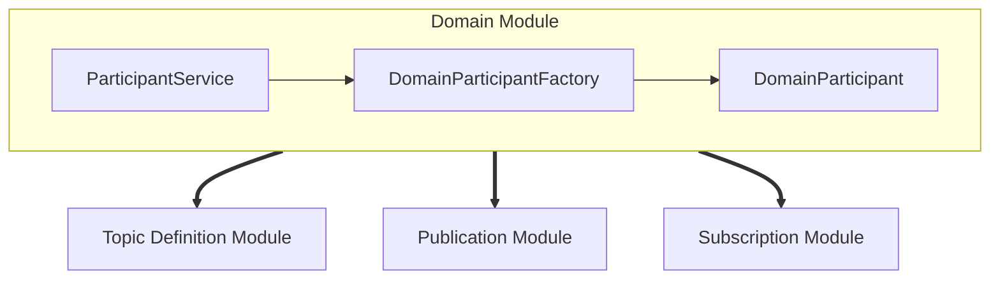

# OpenDDSharp Domain Module

## Participant Service Class

The Participant Service is singleton class in OpenDDSharp that provides the primary interface for managing
the DDS participants in your application. It allows you to obtain the Domain Participant Factory, set up discovery,
and control the behavior of the DDS entities that will be created.

# Domain Participant Factory Class

## Domain Participant Class
The `DomainParticipant` class is a fundamental component in the DDS (Data Distribution Service) middleware.
It represents a participant in the DDS domain, which is a logical grouping of DDS entities such as publishers,
subscribers, and topics. The `DomainParticipant` provides a context for communication and coordination between
these entities within a domain.

To create a `DomainParticipant` in OpenDDSharp, you typically need to specify a domain ID. The domain ID allows you
to logically separate different DDS systems or applications within a larger infrastructure.
It ensures that DDS entities belonging to different domains do not interfere with each other and enables isolation and
independence between them.

The domain ID acts as an identifier that allows DDS entities to discover and communicate with each other within
the same domain. By assigning different domain IDs to different DDS domains, you can create separate communication
spaces, even within a single physical network. This separation can be beneficial in scenarios where you have multiple
independent systems or applications that need to communicate using DDS, but you want to avoid interference
or data leakage between them.

For example, you might have one domain for a real-time control system and another domain for a monitoring
and analysis system. By assigning distinct domain IDs to these domains, you ensure that the entities in each domain
operate independently and can only communicate within their own domain, providing isolation and control over the data
flow.

In summary, the domain ID is a numeric identifier that distinguishes and separates DDS domains, enabling
independent communication and data exchange between OpenDDSharp entities. Here's an example of how to create a
`DomainParticipant` using the OpenDDSharp C# API:

```csharp
var dpf = ParticipantService.Instance.GetDomainParticipantFactory("-DCPSConfigFile", "rtps.ini");
var participant = dpf.CreateParticipant(42);
```

In this example, the `DomainParticipantFactory` is initialized with command-line arguments and configured with the
`rtps.ini` configuration file. The `CreateParticipant()` method is then called on the `DomainParticipantFactory`
to create a new `DomainParticipant` with the specified domain ID (42 in this case).


## Domain Module Diagram

Here is a diagram illustrating the relationships between the main classes of the Domain Module and Participant Service, Domain Participant Factory,
and Domain Participant class, along with the modules related to them:



## Best Practices

For best practices and additional guidance on using the OpenDDSharp DDS implementation, please refer to the following resources:

1. OpenDDSharp Documentation: [https://github.com/jmmorato/openddsharp/wiki](https://github.com/jmmorato/openddsharp/wiki)
2. DDS Best Practices Guide: [https://www.omg.org/spec/DDS/1.4/PDF/](https://www.omg.org/spec/DDS/1.4/PDF/)
3. OpenDDS Developer's Guide: [http://opendds.org/developers/DevGuide/index.html](http://opendds.org/developers/DevGuide/index.html)

These resources provide comprehensive information on DDS concepts, usage guidelines, and recommended practices for building robust and efficient distributed systems using OpenDDSharp.
