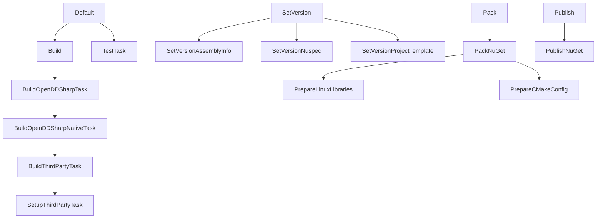

# How to build OpenDDSharp

This guide explains how to build OpenDDSharp locally, following similar steps used by the
[CI/CD workflow](https://github.com/jmmorato/openddsharp/blob/develop/.github/workflows/cd_workflow.yaml).

## Overview

The OpenDDSharp build process is split into two stages:

1. **Native build** — compiles OpenDDS, the OpenDDSharp C++ wrapper (`OpenDDSWrapper`) and the OpenDDSharp IDL compiler (`Native/OpenDDSharp.IdlGenerator`) for your target platform.
2. **Managed build** — compiles the .NET projects (`OpenDDSharp`, `OpenDDSharp.Marshaller`, etc.) against the native artifacts.

Both stages are driven by a [Cake Frosting](https://cakebuild.net/docs/running-builds/runners/cake-frosting) script located in `Build/OpenDDSharp.Build.ps1`.

---

## Prerequisites

### All platforms

| Requirement | Version            |
|-------------|--------------------|
| .NET SDK    | 8.0, 9.0, and 10.0 |
| PowerShell  | 7+ (`pwsh`)        |
| CMake       | Latest stable      |
| Git         | Any recent version |

### Windows

| Requirement        | Notes                                                                                       |
|--------------------|---------------------------------------------------------------------------------------------|
| Visual Studio 2022 | Enterprise, Professional, or Community — with the **Desktop development with C++** workload |
| MSBuild            | Installed with Visual Studio 2022                                                           |
| Strawberry Perl    | Installed to `C:/Strawberry/perl/bin` (default path expected by the build script)           |

### Linux

| Requirement                 | Notes                                    |
|-----------------------------|------------------------------------------|
| build-essential / gcc       | Standard C++ build tools                 |
| Perl                        | Available via the system package manager |
| OpenSSL development headers | `libssl-dev` on Debian/Ubuntu            |

### macOS

| Requirement              | Notes                    |
|--------------------------|--------------------------|
| Xcode Command Line Tools | `xcode-select --install` |
| Homebrew Perl            | `brew install perl`      |
| OpenSSL                  | `brew install openssl`   |

---

## Build Script Parameters Reference

All parameters are passed to `Build/OpenDDSharp.Build.ps1` using `--ParameterName=Value` syntax.

| Parameter                 | Default                  | Description                                           |
|---------------------------|--------------------------|-------------------------------------------------------|
| `--target`                | `Default`                | Cake build target to execute                          |
| `--BuildConfiguration`    | `Release`                | `Release` or `Debug`                                  |
| `--BuildPlatform`         | `x64`                    | `x64`, `x86`, or `ARM64`                              |
| `--OpenDdsVersion`        | `3.34.0`                 | OpenDDS version to download and build                 |
| `--VisualStudioVersion`   | `VS2022`                 | Visual Studio version (Windows only)                  |
| `--VisualStudioEdition`   | `Enterprise`             | VS edition: `Enterprise`, `Professional`, `Community` |
| `--PerlPath`              | `C:/Strawberry/perl/bin` | Path to the Perl binary directory                     |
| `--IgnoreThirdPartySetup` | `False`                  | Skip downloading OpenDDS sources                      |
| `--IgnoreThirdPartyBuild` | `False`                  | Skip compiling OpenDDS                                |
| `--CleanupTemporalFiles`  | `False`                  | Remove temporary build files after completion         |
| `--exclusive`             | _(flag)_                 | Run only the specified target, skipping dependencies  |

### Available targets

| Target                       | Description                                                            |
|------------------------------|------------------------------------------------------------------------|
| `BuildOpenDDSharpNativeTask` | Downloads, sets up, and compiles OpenDDS + OpenDDSharp native wrappers |
| `BuildOpenDDSharpTask`       | Builds the managed .NET projects                                       |
| `TestTask`                   | Runs the unit tests                                                    |
| `SetVersion`                 | Updates version numbers across all project files                       |
| `Pack`                       | Creates the NuGet packages                                             |
| `Publish`                    | Publishes NuGet packages to nuget.org                                  |

#### Target dependency chains

When you invoke a target, Cake automatically runs all of its dependencies first (unless you pass `--exclusive` parameter).



## Step 1 — Build the Native Libraries

The first step to build OpenDDSharp is to build the native libraries. As OpenDDSharp is a wrapper around OpenDDS,
you need to have OpenDDS compiled for your target platform. The build script automates this process by downloading the
specified version of OpenDDS, configuring it up, and compiling it along with the OpenDDSharp C++ wrapper. The OpenDDSharp
C++ wrapper will be used to invoke the native OpenDDS library from managed code via P/Invoke.

For example, to build the native libraries for Windows x64, with Visual Studio 2022 Enterprise edition,
run the following command from the `Build` directory:

```powershell
cd Build
./OpenDDSharp.Build.ps1 `
  --target=BuildOpenDDSharpNativeTask `
  --VisualStudioVersion=VS2022 `
  --VisualStudioEdition=Enterprise `
  --BuildConfiguration=Release `
  --BuildPlatform=x64 `
  --OpenDdsVersion=3.34.0 `
  --IgnoreThirdPartySetup=False `
  --IgnoreThirdPartyBuild=False
```

> **Tip — skipping the third-party setup on subsequent runs:**
> Once OpenDDS has been compiled successfully, you can skip the third-party setup by setting to `True` the
> `IgnoreThirdPartySetup` parameter. For example, to build the native libraries for Windows x86, skipping the
> third-party setup after a previous compilation for x64, run the following command:
> ```powershell
> ./OpenDDSharp.Build.ps1 --target=BuildOpenDDSharpNativeTask --exclusive `
>   --BuildPlatform=x86 --OpenDdsVersion=3.34.0 `
>   --IgnoreThirdPartySetup=True --IgnoreThirdPartyBuild=False
> ```

After a successful native build, the compiled artifacts are placed under:

| Platform    | Directory                                                  |
|-------------|------------------------------------------------------------|
| Windows x64 | `ext/OpenDDS_x64/` and `Native/build_x64/`                 |
| Windows x86 | `ext/OpenDDS_x86/` and `Native/build_x86/`                 |
| Linux x64   | `ext/OpenDDS_linux-x64/` and `Native/build_linux-x64/`     |
| Linux ARM64 | `ext/OpenDDS_linux-arm64/` and `Native/build_linux-arm64/` |
| macOS ARM64 | `ext/OpenDDS_osx-arm64/` and `Native/build_osx-arm64/`     |
| macOS x64   | `ext/OpenDDS_osx-x64/` and `Native/build_osx-x64/`         |

The `ext/OpenDDS_<runtime>/` directory contains the OpenDDS sources and the compiled OpenDDS libraries and tools.
The `Native/build_<runtime>/` directory contains the compiled OpenDDSharp native libraries and tools.

## Step 2 — Set Environment Variables

The managed OpenDDSharp build and test projects require the OpenDDS paths to be exported in your development environment.
That will allow the managed build to find the OpenDDS libraries and headers in the expected locations during development.

You can find all the required paths for your current system in the`setenv.sh` script (`setenv.cmd` on Windows systems)
created during the native build in the `ext` directory of the OpenDDS source code (e.g. `ext/OpenDDS_<runtime>/`).

For example:

**`Windows x64`**
```bash
set "ACE_ROOT=C:\Users\josemorato\Documents\PROJECTS\OPENDDSHARP\ext\OpenDDS_x64\ACE_wrappers"
set "DDS_ROOT=C:\Users\josemorato\Documents\PROJECTS\OPENDDSHARP\ext\OpenDDS_x64"
set "MPC_ROOT=C:\Users\josemorato\Documents\PROJECTS\OPENDDSHARP\ext\OpenDDS_x64\ACE_wrappers\MPC"
set "PATH=%PATH%;C:\Users\josemorato\Documents\PROJECTS\OPENDDSHARP\ext\OpenDDS_x64\ACE_wrappers\bin;C:\Users\josemorato\Documents\PROJECTS\OPENDDSHARP\ext\OpenDDS_x64\bin;C:\Users\josemorato\Documents\PROJECTS\OPENDDSHARP\ext\OpenDDS_x64\ACE_wrappers\lib;C:\Users\josemorato\Documents\PROJECTS\OPENDDSHARP\ext\OpenDDS_x64\lib"
set "RAPIDJSON_ROOT=C:\Users\josemorato\Documents\PROJECTS\OPENDDSHARP\ext\OpenDDS_x64\tools\rapidjson"
set "TAO_ROOT=C:\Users\josemorato\Documents\PROJECTS\OPENDDSHARP\ext\OpenDDS_x64\ACE_wrappers\TAO"
```

**`Linux x64`**
```bash
export ACE_ROOT="/home/josemorato/Projects/OPENDDSHARP/OPENDDSHARP/ext/OpenDDS_linux-x64/ACE_wrappers"
export DDS_ROOT="/home/josemorato/Projects/OPENDDSHARP/OPENDDSHARP/ext/OpenDDS_linux-x64"
export LD_LIBRARY_PATH="${LD_LIBRARY_PATH}:/home/josemorato/Projects/OPENDDSHARP/OPENDDSHARP/ext/OpenDDS_linux-x64/ACE_wrappers/lib:/home/josemorato/Projects/OPENDDSHARP/OPENDDSHARP/ext/OpenDDS_linux-x64/lib"
export MPC_ROOT="/home/josemorato/Projects/OPENDDSHARP/OPENDDSHARP/ext/OpenDDS_linux-x64/ACE_wrappers/MPC"
export PATH="${PATH}:/home/josemorato/Projects/OPENDDSHARP/OPENDDSHARP/ext/OpenDDS_linux-x64/ACE_wrappers/bin:/home/josemorato/Projects/OPENDDSHARP/OPENDDSHARP/ext/OpenDDS_linux-x64/bin"
export RAPIDJSON_ROOT="/home/josemorato/Projects/OPENDDSHARP/OPENDDSHARP/ext/OpenDDS_linux-x64/tools/rapidjson"
export TAO_ROOT="/home/josemorato/Projects/OPENDDSHARP/OPENDDSHARP/ext/OpenDDS_linux-x64/ACE_wrappers/TAO"
```

**`macOS arm64`**
```bash
export ACE_ROOT="/Users/josemorato/Projects/OPENDDSHARP/OPENDDSHARP/ext/OpenDDS_osx-arm64/ACE_wrappers"
export DDS_ROOT="/Users/josemorato/Projects/OPENDDSHARP/OPENDDSHARP/ext/OpenDDS_osx-arm64"
export DYLD_LIBRARY_PATH="${DYLD_LIBRARY_PATH}:/Users/josemorato/Projects/OPENDDSHARP/OPENDDSHARP/ext/OpenDDS_osx-arm64/ACE_wrappers/lib:/Users/josemorato/Projects/OPENDDSHARP/OPENDDSHARP/ext/OpenDDS_osx-arm64/lib"
export MPC_ROOT="/Users/josemorato/Projects/OPENDDSHARP/OPENDDSHARP/ext/OpenDDS_osx-arm64/ACE_wrappers/MPC"
export PATH="${PATH}:/Users/josemorato/Projects/OPENDDSHARP/OPENDDSHARP/ext/OpenDDS_osx-arm64/ACE_wrappers/bin:/Users/josemorato/Projects/OPENDDSHARP/OPENDDSHARP/ext/OpenDDS_osx-arm64/bin"
export RAPIDJSON_ROOT="/Users/josemorato/Projects/OPENDDSHARP/OPENDDSHARP/ext/OpenDDS_osx-arm64/tools/rapidjson"
export TAO_ROOT="/Users/josemorato/Projects/OPENDDSHARP/OPENDDSHARP/ext/OpenDDS_osx-arm64/ACE_wrappers/TAO"
```

> **Tip — permanent environment variables:**
> Ensure that the environment variables are permanently set in your development environment
> (e.g., by adding the export statements to your shell profile or in the Windows Environment Variables dialog) to avoid
> having to set them manually before each build.

---

## Step 3 — Build the Managed Projects

Once the native libraries have been built, you can build the managed OpenDDSharp projects with your preferred IDE or
using the command line. However, to build the unit tests project and some other testing tools, you'll need to "manually"
solve some additional dependencies between the projects first.

The `OpenDDSharp.BuildTasks` project contains some build-time tools used by the IDL code generation projects. As 
some tools depends on an internal IDL project (`Tests/TestIdlCdr`),you will need to build the `BuildTasks` project first:

```bash
dotnet build Sources/OpenDDSharp.BuildTasks/OpenDDSharp.BuildTasks.csproj --configuration Release
```

In addition, some tests use an external support process (`Tests/TestSupportProcess`) to test the inter-process 
communication capabilities of OpenDDSharp.

As the `TestSupportProcess` project depends on OpenDDS native libraries, you will need to ensure that the runtime
identifier is set correctly for your platform. For example, on Windows x64, build the `TestSupportProcess`
project with the following command:

```bash
dotnet build Tests/TestSupportProcess/TestSupportProcess.csproj --configuration Release --runtime win-x64 --self-contained
```

By building the `Tests/OpenDDSharp.UnitTest` you will ensure that the main related projects are built correctly, and
you will be able to run the unit tests later on. You can build the `OpenDDSharp.UnitTest` project for Windows x64 platform
with the following command:

```bash
dotnet build Tests/OpenDDSharp.UnitTest/OpenDDSharp.UnitTest.csproj --configuration Release --runtime win-x64 --self-contained
```

All the previous steps can be automated running the `OpenDDSharp.Build.ps1` script with the target `BuildOpenDDSharpTask` 
from the `Build` directory. For example, to build the managed projects for Windows x64, run the following command:

```powershell
./OpenDDSharp.Build.ps1 `
 --target=BuildOpenDDSharpTask `
 --exclusive `
 --BuildConfiguration=Release `
 --BuildPlatform=x64
```

---

## Step 3 — Run the Unit Tests

Tests are implemented using `MSTest` framework and are located in the `Tests/OpenDDSharp.UnitTest` project.
You can run the tests from your preferred IDE or using the command line. If you are using the command line, ensure that 
the `TestTfmsInParallel` flag is set to `false` to avoid running the tests in parallel. For example, to run the tests
for a Windows x64 platform, use the following command:


```bash
dotnet test Tests/OpenDDSharp.UnitTest/OpenDDSharp.UnitTest.csproj \
  --no-build --no-restore \
  --configuration Release \
  --runtime win-x64 \
  --collect:"XPlat Code Coverage" \
  --settings Tests.runsettings \
  --logger "console;verbosity=normal" \
  -p:TestTfmsInParallel=false
```

You can also run the tests from the `Build` directory using the `TestTask` target from the `OpenDDSharp.Build.ps1`
script. For example, to run the tests for a Windows x64 platform, use the following command:

```powershell
./OpenDDSharp.Build.ps1 `
 --target=TestTask `
 --BuildConfiguration=Release `
 --BuildPlatform=x64
```

## Conclusion

To start developing for OpenDDSharp is not an easy task and requires time and patience, but understanding the build
process and the required environment could help you to get started and contribute to the project. If you have any
questions or need help, feel free to open a [discussion](https://github.com/jmmorato/openddsharp/discussions) in the 
GitHub repository.

---

