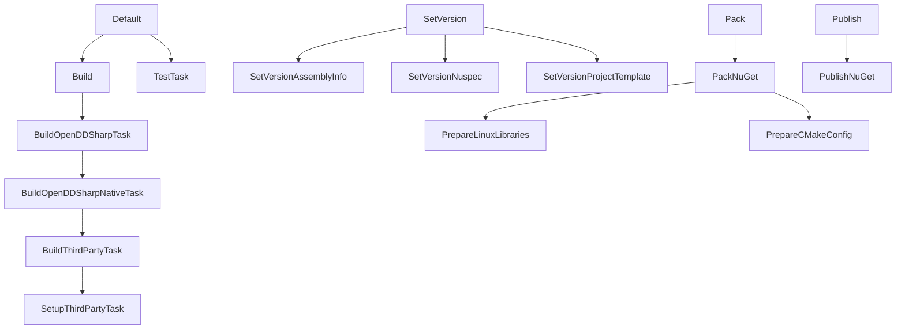

# How to build OpenDDSharp

This guide explains how to build OpenDDSharp locally, following the same steps used by the CI/CD pipeline.

## Overview

The build is split into two stages:

1. **Native build** — compiles OpenDDS and the OpenDDSharp C++ wrapper (`OpenDDSWrapper`) for your target platform.
2. **Managed build** — compiles the .NET projects (`OpenDDSharp`, `OpenDDSharp.Marshaller`, etc.) against the native artifacts.

Both stages are driven by a [Cake Frosting](https://cakebuild.net/docs/running-builds/runners/cake-frosting) script located in `Build/OpenDDSharp.Build.ps1`.

---

## Prerequisites

### All platforms

| Requirement | Version            |
|-------------|--------------------|
| .NET SDK    | 8.0, 9.0, and 10.0 |
| PowerShell  | 7+ (`pwsh`)        |
| CMake       | Latest stable      |
| Git         | Any recent version |

### Windows

| Requirement        | Notes                                                                                       |
|--------------------|---------------------------------------------------------------------------------------------|
| Visual Studio 2022 | Enterprise, Professional, or Community — with the **Desktop development with C++** workload |
| MSBuild            | Installed with Visual Studio 2022                                                           |
| Strawberry Perl    | Installed to `C:/Strawberry/perl/bin` (default path expected by the build script)           |

### Linux

| Requirement                 | Notes                                    |
|-----------------------------|------------------------------------------|
| build-essential / gcc       | Standard C++ build tools                 |
| Perl                        | Available via the system package manager |
| OpenSSL development headers | `libssl-dev` on Debian/Ubuntu            |

### macOS

| Requirement              | Notes                    |
|--------------------------|--------------------------|
| Xcode Command Line Tools | `xcode-select --install` |
| Homebrew Perl            | `brew install perl`      |
| OpenSSL                  | `brew install openssl`   |

---

## Build Script Parameters Reference

All parameters are passed to `Build/OpenDDSharp.Build.ps1` using `--ParameterName=Value` syntax.

| Parameter                 | Default                  | Description                                           |
|---------------------------|--------------------------|-------------------------------------------------------|
| `--target`                | `Default`                | Cake build target to execute                          |
| `--BuildConfiguration`    | `Release`                | `Release` or `Debug`                                  |
| `--BuildPlatform`         | `x64`                    | `x64`, `x86`, or `ARM64`                              |
| `--OpenDdsVersion`        | `3.33.0`                 | OpenDDS version to download and build                 |
| `--VisualStudioVersion`   | `VS2022`                 | Visual Studio version (Windows only)                  |
| `--VisualStudioEdition`   | `Enterprise`             | VS edition: `Enterprise`, `Professional`, `Community` |
| `--PerlPath`              | `C:/Strawberry/perl/bin` | Path to the Perl binary directory                     |
| `--IgnoreThirdPartySetup` | `False`                  | Skip downloading OpenDDS sources                      |
| `--IgnoreThirdPartyBuild` | `False`                  | Skip compiling OpenDDS                                |
| `--CleanupTemporalFiles`  | `False`                  | Remove temporary build files after completion         |
| `--exclusive`             | _(flag)_                 | Run only the specified target, skipping dependencies  |

### Available targets

| Target                       | Description                                                            |
|------------------------------|------------------------------------------------------------------------|
| `BuildOpenDDSharpNativeTask` | Downloads, sets up, and compiles OpenDDS + OpenDDSharp native wrappers |
| `BuildOpenDDSharpTask`       | Builds the managed .NET projects                                       |
| `TestTask`                   | Runs the unit tests                                                    |
| `SetVersion`                 | Updates version numbers across all project files                       |
| `Pack`                       | Creates the NuGet packages                                             |
| `Publish`                    | Publishes NuGet packages to nuget.org                                  |

#### Target dependency chains

When you invoke a target, Cake automatically runs all of its dependencies first (unless you pass `--exclusive`).



## Step 1 — Build the Native Libraries

Run the build script from the `Build` directory. The `BuildOpenDDSharpNativeTask` target downloads, configures, and compiles OpenDDS along with the C++ wrappers.

### Windows (x64)

```powershell
cd Build
./OpenDDSharp.Build.ps1 `
  --target=BuildOpenDDSharpNativeTask `
  --VisualStudioVersion=VS2022 `
  --VisualStudioEdition=Enterprise `
  --BuildConfiguration=Release `
  --BuildPlatform=x64 `
  --OpenDdsVersion=3.33.0 `
  --IgnoreThirdPartySetup=False `
  --IgnoreThirdPartyBuild=False
```

### Windows (x86)

```powershell
cd Build
./OpenDDSharp.Build.ps1 `
  --target=BuildOpenDDSharpNativeTask `
  --VisualStudioVersion=VS2022 `
  --VisualStudioEdition=Enterprise `
  --BuildConfiguration=Release `
  --BuildPlatform=x86 `
  --OpenDdsVersion=3.33.0 `
  --IgnoreThirdPartySetup=False `
  --IgnoreThirdPartyBuild=False
```

### Linux (x64)

```powershell
cd Build
./OpenDDSharp.Build.ps1 `
  --target=BuildOpenDDSharpNativeTask `
  --BuildConfiguration=Release `
  --BuildPlatform=x64 `
  --OpenDdsVersion=3.33.0 `
  --IgnoreThirdPartySetup=False `
  --IgnoreThirdPartyBuild=False
```

### Linux (ARM64)

```powershell
cd Build
./OpenDDSharp.Build.ps1 `
  --target=BuildOpenDDSharpNativeTask `
  --BuildConfiguration=Release `
  --BuildPlatform=ARM64 `
  --OpenDdsVersion=3.33.0 `
  --IgnoreThirdPartySetup=False `
  --IgnoreThirdPartyBuild=False
```

### macOS (Apple Silicon / ARM64)

```powershell
cd Build
./OpenDDSharp.Build.ps1 `
  --target=BuildOpenDDSharpNativeTask `
  --BuildConfiguration=Release `
  --BuildPlatform=ARM64 `
  --OpenDdsVersion=3.33.0 `
  --IgnoreThirdPartySetup=False `
  --IgnoreThirdPartyBuild=False
```

### macOS (Intel / x64)

```powershell
cd Build
./OpenDDSharp.Build.ps1 `
  --target=BuildOpenDDSharpNativeTask `
  --BuildConfiguration=Release `
  --BuildPlatform=x64 `
  --OpenDdsVersion=3.33.0 `
  --IgnoreThirdPartySetup=False `
  --IgnoreThirdPartyBuild=False
```

> **Tip — skipping the third-party build on subsequent runs:**
> Once OpenDDS has been compiled successfully, you can skip the lengthy third-party build by setting both flags to `True` and adding `--exclusive`:
> ```powershell
> ./OpenDDSharp.Build.ps1 --target=BuildOpenDDSharpNativeTask --exclusive `
>   --BuildPlatform=x64 --OpenDdsVersion=3.33.0 `
>   --IgnoreThirdPartySetup=True --IgnoreThirdPartyBuild=True
> ```

After a successful native build the compiled artifacts are placed under:

| Platform    | Directory                                                  |
|-------------|------------------------------------------------------------|
| Windows x64 | `ext/OpenDDS_x64/` and `Native/build_x64/`                 |
| Windows x86 | `ext/OpenDDS_x86/` and `Native/build_x86/`                 |
| Linux x64   | `ext/OpenDDS_linux-x64/` and `Native/build_linux-x64/`     |
| Linux ARM64 | `ext/OpenDDS_linux-arm64/` and `Native/build_linux-arm64/` |
| macOS ARM64 | `ext/OpenDDS_osx-arm64/` and `Native/build_osx-arm64/`     |
| macOS x64   | `ext/OpenDDS_osx-x64/` and `Native/build_osx-x64/`         |

---

## Step 2 — Set Environment Variables

The managed build and tests require the OpenDDS paths to be exported. Adjust the paths to match the platform and architecture you built in Step 1.

### Windows (x64)

```powershell
$env:DDS_ROOT = "$PWD\ext\OpenDDS_x64"
$env:ACE_ROOT = "$PWD\ext\OpenDDS_x64\ACE_wrappers"
$env:TAO_ROOT = "$PWD\ext\OpenDDS_x64\ACE_wrappers\TAO"
$env:PATH    += ";$PWD\ext\OpenDDS_x64\lib;$PWD\ext\OpenDDS_x64\ACE_wrappers\lib"
```

### Linux (x64)

```bash
export DDS_ROOT="$PWD/ext/OpenDDS_linux-x64"
export ACE_ROOT="$PWD/ext/OpenDDS_linux-x64/ACE_wrappers"
export TAO_ROOT="$PWD/ext/OpenDDS_linux-x64/ACE_wrappers/TAO"
export LD_LIBRARY_PATH="$PWD/ext/OpenDDS_linux-x64/lib:$PWD/ext/OpenDDS_linux-x64/ACE_wrappers/lib:."
```

### macOS (ARM64)

```bash
export DDS_ROOT="$PWD/ext/OpenDDS_osx-arm64"
export ACE_ROOT="$PWD/ext/OpenDDS_osx-arm64/ACE_wrappers"
export TAO_ROOT="$PWD/ext/OpenDDS_osx-arm64/ACE_wrappers/TAO"
export DYLD_LIBRARY_PATH="$PWD/ext/OpenDDS_osx-arm64/lib:$PWD/ext/OpenDDS_osx-arm64/ACE_wrappers/lib:."
export DYLD_FALLBACK_LIBRARY_PATH="$DYLD_LIBRARY_PATH"
```

---

## Step 3 — Restore NuGet Packages

```bash
dotnet restore OpenDDSharp.sln --no-cache --configfile nuget.config
dotnet restore Tests/OpenDDSharp.UnitTest/OpenDDSharp.UnitTest.csproj --no-cache --configfile nuget.config
dotnet restore Tests/TestSupportProcess/TestSupportProcess.csproj --no-cache --configfile nuget.config
dotnet restore Tests/TestIdlCdr/TestIdlCdr.csproj --no-cache --configfile nuget.config
dotnet restore Tests/BenchmarkPerformance/BenchmarkPerformance.csproj --no-cache --configfile nuget.config
dotnet restore Examples/ConsoleDemo/ConsoleDemo.csproj --no-cache --configfile nuget.config
```

---

## Step 4 — Build the Managed Projects

Build the `OpenDDSharp.BuildTasks` project first — it is required by the other projects as a build-time tool:

```bash
dotnet build Sources/OpenDDSharp.BuildTasks/OpenDDSharp.BuildTasks.csproj --configuration Release
```

Then build the main library. On Windows the pipeline builds all four platform targets; for local development build only the target you need:

```bash
# Any CPU (works on all platforms)
dotnet msbuild -target:build Sources/OpenDDSharp/OpenDDSharp.csproj \
  -property:Configuration=Release -property:Platform=AnyCPU

# x64 only
dotnet msbuild -target:build Sources/OpenDDSharp/OpenDDSharp.csproj \
  -property:Configuration=Release -property:Platform=x64

# Marshaller — same pattern
dotnet msbuild -target:build Sources/OpenDDSharp.Marshaller/OpenDDSharp.Marshaller.csproj \
  -property:Configuration=Release -property:Platform=AnyCPU
```

---

## Step 5 — Run the Unit Tests

Build the test support projects first, then run the tests:

```bash
# Runtime identifier — adjust to match your platform:
#   win-x64 | win-x86 | linux-x64 | linux-arm64 | osx-arm64 | osx-x64
RUNTIME=linux-x64

dotnet build Tests/TestSupportProcess/TestSupportProcess.csproj \
  --configuration Release --runtime $RUNTIME --self-contained

dotnet build Tests/OpenDDSharp.UnitTest/OpenDDSharp.UnitTest.csproj \
  --configuration Release --runtime $RUNTIME --self-contained

dotnet test Tests/OpenDDSharp.UnitTest/OpenDDSharp.UnitTest.csproj \
  --no-build --no-restore \
  --configuration Release \
  --runtime $RUNTIME \
  --collect:"XPlat Code Coverage" \
  --settings Tests.runsettings \
  --logger "console;verbosity=normal" \
  -p:TestTfmsInParallel=false
```

---

