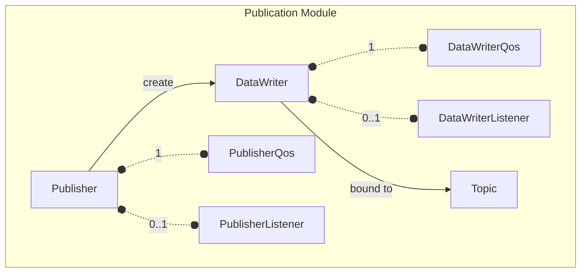
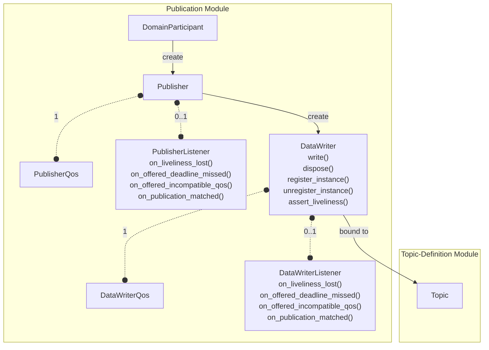

# OpenDDSharp Publication Module

The Publication module is the component of the Data Distribution Service (DDS) standard
(OMG DDS 1.4) responsible for the dissemination of data. It provides the abstractions needed to
publish typed data samples to a DDS domain, allowing other participants to receive those samples through
the Subscription module.

The module comprises the following classes:

- **Publisher** — manages a group of `DataWriter` objects and controls their collective behavior.
- **DataWriter** — the entity through which typed data samples are actually written to the domain.
- **PublisherListener** — receives status-change notifications at the `Publisher` level.
- **DataWriterListener** — receives status-change notifications at the `DataWriter` level.



## Publisher Class

Per the DDS specification, a `Publisher` is the object responsible for the actual dissemination of
publications. It acts on behalf of one or several `DataWriter` objects that belong to it. When it is informed of
a change to the data associated with one of its `DataWriter` objects, it decides when it is appropriate to send
the data-update message, taking into consideration the timestamps, QoS of the `Publisher`, and the QoS of the
`DataWriter`.

A `Publisher` is created by the `DomainParticipant` and belongs to it. It acts as a factory for `DataWriter`
objects:

```csharp
var publisher = participant.CreatePublisher();
```

> Per the spec, all operations on a `Publisher` except `SetQos`, `GetQos`, `SetListener`, `GetListener`,
> `Enable`, `GetStatusCondition`, `CreateDataWriter`, and `DeleteDataWriter` may return
> `ReturnCode.NotEnabled` if the `Publisher` has not been enabled yet.

### Creating and Deleting DataWriters

The primary role of a `Publisher` is to act as a factory for `DataWriter` objects. The `DataWriter` returned by
`CreateDataWriter` is a derived class specific to the data type associated with the `Topic`:

```csharp
var support = new MyTypeTypeSupport();
support.RegisterType(participant, support.GetTypeName());
var topic = participant.CreateTopic("MyTopic", support.GetTypeName());

// Create a DataWriter with default QoS
var writer = publisher.CreateDataWriter(topic);

// Or with custom QoS and a listener
var qos = new DataWriterQos
{
    Reliability = { Kind = ReliabilityQosPolicyKind.ReliableReliabilityQos },
};
var listener = new MyDataWriterListener();
var writer = publisher.CreateDataWriter(topic, qos, listener);
```

To delete a `DataWriter`, call `DeleteDataWriter` on the same `Publisher` that created it. Deleting a
`DataWriter` automatically unregisters all its instances. Depending on the `WriterDataLifecycle` QoS policy,
deletion may also dispose all instances:

```csharp
publisher.DeleteDataWriter(writer);
```

All `DataWriter` objects created by a `Publisher` can be deleted in one call using `DeleteContainedEntities`.
The `Publisher` itself can safely be deleted only after `DeleteContainedEntities` returns `ReturnCode.Ok`:

```csharp
publisher.DeleteContainedEntities();
participant.DeletePublisher(publisher);
```

### Suspend and Resume Publications

The `Publisher` provides a hint to the service that the application is about to make multiple modifications.
This allows the middleware to optimize performance by holding and batching the modifications:

```csharp
publisher.SuspendPublications();

// Multiple writes that will be sent as a batch
writer.Write(sample1);
writer.Write(sample2);
writer.Write(sample3);

publisher.ResumePublications();
```

`ResumePublications` must be called after `SuspendPublications`. If the `Publisher` is deleted before
`ResumePublications` is called, any suspended updates will be discarded.

### Coherent Changes

A `Publisher` can group a set of modifications into a **coherent set** — changes that must be received by
subscribers as a unit. Subscribers will only be able to access the data after all modifications in the set
are available:

```csharp
publisher.BeginCoherentChanges();

// These changes will be seen atomically by subscribers
writer1.Write(altitude);
writer2.Write(velocityVector);

publisher.EndCoherentChanges();
```

> Per the spec, calls to `BeginCoherentChanges` / `EndCoherentChanges` can be nested.
> The coherent set terminates only with the last call to `EndCoherentChanges`. If there is no matching
> `BeginCoherentChanges`, `EndCoherentChanges` returns `ReturnCode.PreconditionNotMet`.
>
> If a connectivity change occurs during a coherent set (e.g., a late-joining reader appears), the subscriber
> that cannot receive the entire set behaves as if it had received none of the changes.

### Wait for Acknowledgments

For reliable communication, you can block the calling thread until all data written by the `Publisher`'s
`DataWriter` objects has been acknowledged by all matched reliable `DataReader` entities, or until a timeout
elapses:

```csharp
var result = publisher.WaitForAcknowledgments(new Duration { Seconds = 10 });
if (result == ReturnCode.Ok)
{
    Console.WriteLine("All samples acknowledged.");
}
else if (result == ReturnCode.Timeout)
{
    Console.WriteLine("Timeout waiting for acknowledgments.");
}
```

### Default DataWriter QoS

The `Publisher` maintains a set of default `DataWriterQos` values applied to all `DataWriter` objects created
without explicit QoS. A convenient pattern for constructing `DataWriter` QoS is to start with the Topic QoS
and merge it with the `Publisher`'s default `DataWriter` QoS:

```csharp
// Retrieve the current default DataWriter QoS
var qos = new DataWriterQos();
publisher.GetDefaultDataWriterQos(qos);

// Override specific policies
qos.Liveliness.Kind = LivelinessQosPolicyKind.ManualByTopicLivelinessQos;
qos.Liveliness.LeaseDuration = new Duration { Seconds = 5 };

// Apply as the new default
publisher.SetDefaultDataWriterQos(qos);
```

For a detailed description, please refer to the
[Publisher API Reference](xref:OpenDDSharp.DDS.Publisher) documentation.

### PublisherQos Class

The `PublisherQos` class holds the QoS policies that control the behavior of the `Publisher` as a whole. These
are the policies that apply collectively to all `DataWriter` objects that belong to it:

| Policy          | Default Value                                   | RxO | Changeable |
|-----------------|-------------------------------------------------|:---:|:----------:|
| `Presentation`  | `Instance` scope, coherent=false, ordered=false | Yes |   **No**   |
| `Partition`     | Empty (matches default partition)               | No  |    Yes     |
| `GroupData`     | Empty sequence                                  | No  |    Yes     |
| `EntityFactory` | `AutoenableCreatedEntities = true`              | No  |    Yes     |

- **`Presentation`** — Controls the scope and ordering of changes. `Instance` scope (default) treats each
  instance independently. `Topic` scope enables ordering/coherency within a single `DataWriter`. `Group` scope
  spans all `DataWriter` objects in the `Publisher`. Compatibility requires offered scope >= requested scope.
- **`Partition`** — Provides a logical partitioning of the domain. A `DataWriter` only communicates with a
  `DataReader` if they share at least one common partition string (including regex matching). The empty partition
  name `""` is a valid partition. Default is an empty sequence, treated as equivalent to `[""]`.
- **`GroupData`** — Application-defined opaque data propagated via built-in topics. Useful for implementing
  custom matching policies in `DataWriterListener` or `DataReaderListener`.
- **`EntityFactory`** — If `AutoenableCreatedEntities` is `true` (default), all `DataWriter` objects created
  by this `Publisher` are automatically enabled upon creation.

```csharp
var qos = new PublisherQos
{
    Partition =
    {
        Name = new List<string> { "MyPartition" },
    },
    EntityFactory =
    {
        AutoenableCreatedEntities = false,
    },
};
var publisher = participant.CreatePublisher(qos);
```

For a detailed description, please refer to the
[PublisherQos API Reference](xref:OpenDDSharp.DDS.PublisherQos) documentation.

### PublisherListener Class

The `PublisherListener` is an abstract class that can be registered with a `Publisher` to receive notifications
about status changes on **any** of its contained `DataWriter` objects. Per the spec (2.2.2.4.3), `Publisher`
has no additional listener operations beyond those inherited from `DataWriterListener`. The `PublisherListener`
acts as a fallback: if a `DataWriter` has no listener attached, the status change propagates to the
`PublisherListener`.

The following callbacks must be implemented:

| Callback                   | Status                     | Description                                                                                                                         |
|----------------------------|----------------------------|-------------------------------------------------------------------------------------------------------------------------------------|
| `OnLivelinessLost`         | `LIVELINESS_LOST`          | The `DataWriter` failed to assert its liveliness within the lease duration. Matched `DataReader` objects will consider it inactive. |
| `OnOfferedDeadlineMissed`  | `OFFERED_DEADLINE_MISSED`  | The `DataWriter` failed to write a new value for an instance within the committed deadline period.                                  |
| `OnOfferedIncompatibleQos` | `OFFERED_INCOMPATIBLE_QOS` | A `DataReader` was found with a requested QoS incompatible with the `DataWriter`'s offered QoS.                                     |
| `OnPublicationMatched`     | `PUBLICATION_MATCHED`      | A compatible `DataReader` has been found (or a previously matched one has been removed).                                            |

```csharp
public class MyPublisherListener : PublisherListener
{
    public override void OnLivelinessLost(DataWriter writer, LivelinessLostStatus status)
    {
        Console.WriteLine($"Liveliness lost on writer for topic: {writer.Topic.Name}");
        Console.WriteLine($"  Total count: {status.TotalCount}");
    }

    public override void OnOfferedDeadlineMissed(DataWriter writer, OfferedDeadlineMissedStatus status)
    {
        Console.WriteLine($"Deadline missed on writer for topic: {writer.Topic.Name}");
        Console.WriteLine($"  Total count: {status.TotalCount}");
    }

    public override void OnOfferedIncompatibleQos(DataWriter writer, OfferedIncompatibleQosStatus status)
    {
        Console.WriteLine($"Incompatible QoS on writer for topic: {writer.Topic.Name}");
        Console.WriteLine($"  Last policy: {status.LastPolicyId}");
    }

    public override void OnPublicationMatched(DataWriter writer, PublicationMatchedStatus status)
    {
        Console.WriteLine($"Publication matched on writer for topic: {writer.Topic.Name}");
        Console.WriteLine($"  Current matched count: {status.CurrentCount}");
    }
}
```

Register the listener during `Publisher` creation or later via `SetListener`:

```csharp
var listener = new MyPublisherListener();
var publisher = participant.CreatePublisher(null, listener);

// Or update it later
publisher.SetListener(listener, StatusMask.OfferedDeadlineMissed | StatusMask.PublicationMatched);

// Remove the listener
publisher.SetListener(null);
```

For a detailed description, please refer to the
[PublisherListener API Reference](xref:OpenDDSharp.DDS.PublisherListener) documentation.

## DataWriter Class

Per the DDS specification (2.2.2.4.2), `DataWriter` allows the application to set the value of the data to
be published under a given `Topic`. A `DataWriter` is attached to exactly one `Publisher` that acts as its
factory, and bound to exactly one `Topic` and therefore to exactly one data type. The `Topic` must exist prior
to the `DataWriter`'s creation.

`DataWriter` is an abstract class specialized for each application data type by the code generator. For
a hypothetical IDL type `MyType`, the generator creates a `MyTypeDataWriter` class that extends `DataWriter`
with typed `Write`, `Dispose`, `RegisterInstance`, and `UnregisterInstance` operations.

A `DataWriter` is created via `Publisher.CreateDataWriter()`:

```csharp
// The generated typed writer is cast from the base DataWriter
var writer = (MyTypeDataWriter)publisher.CreateDataWriter(topic);
```

> Per the spec, all `DataWriter` operations except `SetQos`, `GetQos`, `SetListener`, `GetListener`,
> `Enable`, and `GetStatusCondition` may return `ReturnCode.NotEnabled` if the `DataWriter` has not
> been enabled yet.

### Instance Lifecycle

DDS organizes data around the concept of **instances** — individual objects identified by their key fields.
The `DataWriter` provides operations to manage the full lifecycle of each instance:

**RegisterInstance** — Informs the service that the application intends to modify a particular instance,
allowing the middleware to pre-configure itself for better performance. Returns an `InstanceHandle` that can
be reused in subsequent operations. Registration is idempotent: calling it again for an already-registered
instance returns the existing handle.

```csharp
var sample = new MyType { Key = "sensor-1", Value = 42 };
var handle = writer.RegisterInstance(sample);
```

**Write** — Publishes a new value for a data instance. The service automatically supplies the
`source_timestamp` made available to readers in the `SampleInfo`. As a side effect, this operation **asserts
liveliness** on the `DataWriter`, its `Publisher`, and the `DomainParticipant`.

```csharp
// Write using an explicit handle for better performance
sample.Value = 100;
writer.Write(sample, handle);

// Or let the service identify the instance from the key fields
writer.Write(sample);
```

If `Reliability` is `Reliable` and the `ResourceLimits` are exhausted, `Write` may block for up to
`max_blocking_time` before returning `ReturnCode.Timeout`.

**WriteWithTimestamp** — Same as `Write` but with an explicit `source_timestamp`. Useful when the
application controls the ordering of changes (in conjunction with `DestinationOrder` = `BySourceTimestamp`):

```csharp
writer.WriteWithTimestamp(sample, handle, new Timestamp { Seconds = 1000, NanoSeconds = 0 });
```

**UnregisterInstance** — Signals that the `DataWriter` no longer has anything to say about the instance.
The instance transitions to `NOT_ALIVE_NO_WRITERS` state at matched readers if no other writer exists.
Calling `UnregisterInstance` relinquishes exclusive ownership if the `Ownership` kind is `Exclusive`:

```csharp
writer.UnregisterInstance(sample, handle);
```

**Dispose** — Requests the middleware to delete the data instance. Matched readers that know the instance
receive a notification with `instance_state = NOT_ALIVE_DISPOSED`:

```csharp
writer.Dispose(sample, handle);
```

### Wait for Acknowledgments

For a reliable `DataWriter`, you can block until all written samples have been acknowledged:

```csharp
var result = writer.WaitForAcknowledgments(new Duration { Seconds = 5 });
```

This operation returns immediately with `ReturnCode.Ok` if the `DataWriter` is configured with
`BestEffort` reliability.

### Assert Liveliness

For `DataWriter` entities with `Liveliness` kind set to `ManualByParticipant` or `ManualByTopic`, liveliness
must be explicitly asserted if the application is not writing data regularly:

```csharp
writer.AssertLiveliness();
```

> Writing data via `Write` already asserts liveliness on the `DataWriter`, its `Publisher`, and the
> `DomainParticipant`. Use `AssertLiveliness` only when data is not being written within the `lease_duration`.

### Inspecting Matched Subscriptions

You can query the list of subscriptions currently associated with the `DataWriter` (matching `Topic` and
compatible QoS that have not been ignored):

```csharp
var handles = new List<InstanceHandle>();
var result = writer.GetMatchedSubscriptions(handles);

foreach (var handle in handles)
{
    var data = new SubscriptionBuiltinTopicData();
    writer.GetMatchedSubscriptionData(handle, ref data);
    Console.WriteLine($"Matched subscriber partition: {string.Join(",", data.Partition.Name)}");
}
```

For a detailed description, please refer to the
[DataWriter API Reference](xref:OpenDDSharp.DDS.DataWriter) documentation.

### DataWriterQos Class

The `DataWriterQos` class holds all QoS policies that control the behavior of a `DataWriter`. Note that the
default `Reliability` kind for `DataWriter` is `Reliable` (unlike `Topic`, which defaults to `BestEffort`):

| Policy                | Default Value                              | RxO | Changeable |
|-----------------------|--------------------------------------------|:---:|:----------:|
| `UserData`            | Empty sequence                             | No  |    Yes     |
| `Durability`          | `Volatile`                                 | Yes |   **No**   |
| `DurabilityService`   | `KeepLast`, depth=1; limits=unlimited      |  —  |   **No**   |
| `Deadline`            | Period = infinite                          | Yes |    Yes     |
| `LatencyBudget`       | Duration = 0                               | Yes |    Yes     |
| `Liveliness`          | `Automatic`, lease_duration = infinite     | Yes |   **No**   |
| `Reliability`         | **`Reliable`**, max_blocking_time = 100 ms | Yes |   **No**   |
| `DestinationOrder`    | `ByReceptionTimestamp`                     | Yes |   **No**   |
| `History`             | `KeepLast`, depth = 1                      | No  |   **No**   |
| `ResourceLimits`      | All `LengthUnlimited`                      | No  |   **No**   |
| `TransportPriority`   | 0                                          | N/A |    Yes     |
| `Lifespan`            | Duration = infinite                        | N/A |    Yes     |
| `Ownership`           | `Shared`                                   | Yes |   **No**   |
| `OwnershipStrength`   | 0                                          | N/A |    Yes     |
| `WriterDataLifecycle` | `AutodisposeUnregisteredInstances = true`  | N/A |    Yes     |

Key policies unique to `DataWriter`:

- **`UserData`** — Application-defined opaque data attached to the `DataWriter` and distributed via built-in
  topics. Can be used to attach security credentials or other application-specific information.
- **`OwnershipStrength`** — Only applies when `Ownership` kind is `Exclusive`. The `DataWriter` with the
  highest strength among currently live writers "owns" each data instance. The default strength is 0.
- **`WriterDataLifecycle`** — When `AutodisposeUnregisteredInstances` is `true` (default), deleting the
  `DataWriter` or calling `UnregisterInstance` automatically disposes the affected instances, sending a
  `NOT_ALIVE_DISPOSED` notification to matched readers.

```csharp
var qos = new DataWriterQos
{
    Durability =
    {
        Kind = DurabilityQosPolicyKind.TransientLocalDurabilityQos,
    },
    Reliability =
    {
        Kind = ReliabilityQosPolicyKind.ReliableReliabilityQos,
        MaxBlockingTime = new Duration { Seconds = 1 },
    },
    History =
    {
        Kind = HistoryQosPolicyKind.KeepLastHistoryQos,
        Depth = 10,
    },
    Ownership =
    {
        Kind = OwnershipQosPolicyKind.ExclusiveOwnershipQos,
    },
    OwnershipStrength =
    {
        Value = 100,
    },
};

var writer = publisher.CreateDataWriter(topic, qos);
```

For a detailed description, please refer to the
[DataWriterQos API Reference](xref:OpenDDSharp.DDS.DataWriterQos) documentation.

### DataWriterListener Class

The `DataWriterListener` is an abstract class that can be registered with a `DataWriter` to receive
asynchronous notifications about its specific status changes. It has the same four callbacks as
`PublisherListener`, but applies to a single `DataWriter`:

| Callback                   | Triggered when...                                                        |
|----------------------------|--------------------------------------------------------------------------|
| `OnLivelinessLost`         | The `DataWriter` did not assert liveliness within its `lease_duration`.  |
| `OnOfferedDeadlineMissed`  | The `DataWriter` missed its `Deadline` period for at least one instance. |
| `OnOfferedIncompatibleQos` | A `DataReader` with incompatible QoS was discovered.                     |
| `OnPublicationMatched`     | A compatible `DataReader` was matched or unmatched.                      |

```csharp
public class MyDataWriterListener : DataWriterListener
{
    public override void OnLivelinessLost(DataWriter writer, LivelinessLostStatus status)
    {
        Console.WriteLine($"Liveliness lost. Total count: {status.TotalCount}");
    }

    public override void OnOfferedDeadlineMissed(DataWriter writer, OfferedDeadlineMissedStatus status)
    {
        Console.WriteLine($"Deadline missed. Instance: {status.LastInstanceHandle}");
    }

    public override void OnOfferedIncompatibleQos(DataWriter writer, OfferedIncompatibleQosStatus status)
    {
        Console.WriteLine($"Incompatible QoS detected. Policy: {status.LastPolicyId}");
    }

    public override void OnPublicationMatched(DataWriter writer, PublicationMatchedStatus status)
    {
        Console.WriteLine($"Publication matched. Current count: {status.CurrentCount}");
    }
}
```

Register the listener during `DataWriter` creation or via `SetListener`:

```csharp
var listener = new MyDataWriterListener();
var writer = publisher.CreateDataWriter(topic, null, listener);

// Or update the listener (with a mask) after creation
writer.SetListener(listener, StatusMask.LivelinessLost | StatusMask.PublicationMatched);

// Remove the listener
writer.SetListener(null);
```

For a detailed description, please refer to the
[DataWriterListener API Reference](xref:OpenDDSharp.DDS.DataWriterListener) documentation.

## Publication Module Diagram

The following diagram illustrates the class model of the Publication module as defined in the DDS specification
(2.2.2.4, Figure 2.9), showing the relationships between its classes and their connection to the
Topic-Definition module:


