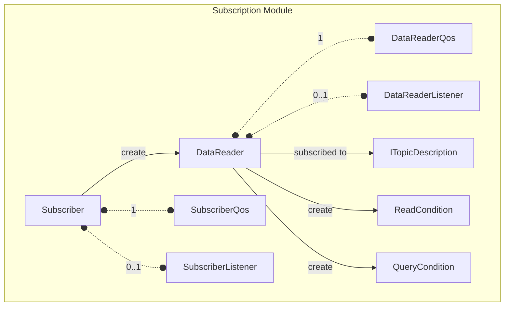
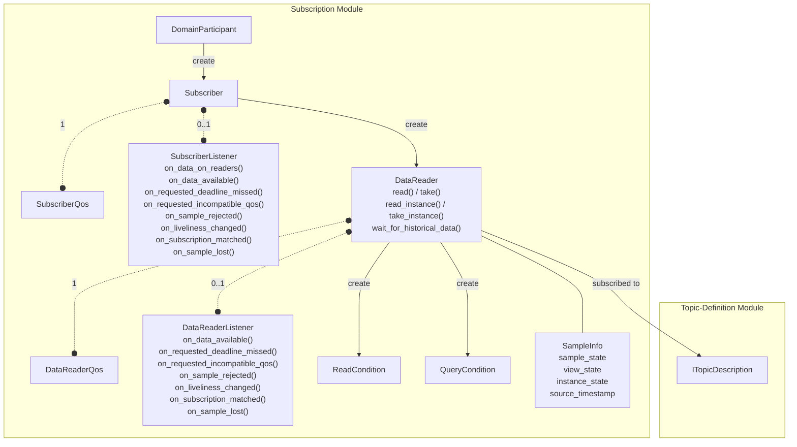

# OpenDDSharp Subscription Module

The Subscription module is the component of the Data Distribution Service (DDS) standard
(OMG DDS 1.4) responsible for the reception of data. It provides the abstractions needed to
declare interest in data and to access the received samples, including mechanisms for filtering, ordering, and
state tracking of data instances.

The module consists of the following classes:

- **Subscriber** — manages a group of `DataReader` objects and coordinates their access to received data.
- **DataReader** — the entity through which typed data samples are received and accessed.
- **SampleInfo** — metadata coming with each sample, describing its state, instance, and timing.
- **SubscriberListener** — receives status-change notifications at the `Subscriber` level.
- **DataReaderListener** — receives status-change notifications at the `DataReader` level.
- **ReadCondition / QueryCondition** — conditions for filtering data access and integrating with wait-sets.



## Subscriber Class

Per the DDS specification, a `Subscriber` is the object responsible for the actual reception of
data resulting from its subscriptions. It acts on behalf of one or several `DataReader` objects related to it.
When it receives data from other parts of the system, it builds the list of concerned `DataReader` objects and
indicates to the application that data is available — through its listener or by enabling related conditions.
The application can then access the list of concerned `DataReader` objects through `GetDataReaders` and access
the data through operations on those `DataReader` objects.

A `Subscriber` is created by the `DomainParticipant`:

```csharp
var subscriber = participant.CreateSubscriber();
```

> Per the spec, all `Subscriber` operations except `SetQos`, `GetQos`, `SetListener`, `GetListener`,
> `Enable`, `GetStatusCondition`, and `CreateDataReader` may return `ReturnCode.NotEnabled` if the
> `Subscriber` has not been enabled yet.

### Creating and Deleting DataReaders

The primary role of a `Subscriber` is to act as a factory for `DataReader` objects. The `DataReader` is
specialized for the data type associated with the topic. The `ITopicDescription` passed to `CreateDataReader`
can be a `Topic`, a `ContentFilteredTopic`, or a `MultiTopic`:

```csharp
var support = new MyTypeTypeSupport();
support.RegisterType(participant, support.GetTypeName());
var topic = participant.CreateTopic("MyTopic", support.GetTypeName());

// Create a DataReader with default QoS
var reader = subscriber.CreateDataReader(topic);

// Or with custom QoS and a listener
var qos = new DataReaderQos
{
    Reliability = { Kind = ReliabilityQosPolicyKind.ReliableReliabilityQos },
};
var listener = new MyDataReaderListener();
var reader = subscriber.CreateDataReader(topic, qos, listener);
```

The `DeleteDataReader` operation must be called on the same `Subscriber` that created it:

```csharp
// Delete ReadConditions/QueryConditions first
reader.DeleteContainedEntities();
subscriber.DeleteDataReader(reader);
```

All contained `DataReader` objects (and their conditions) can be deleted recursively with
`DeleteContainedEntities`. The `Subscriber` can then be safely deleted:

```csharp
subscriber.DeleteContainedEntities();
participant.DeleteSubscriber(subscriber);
```

**Deletion constraints** — A `DataReader` cannot be deleted while:
- Any `ReadCondition` or `QueryCondition` objects are attached to it.
- There are outstanding loans from a `Read` or `Take` operation
  - OpenDDSharp will call `ReturnLoan` automatically for you, in each `Read` or `Take` calls.

### Coherent Access with BeginAccess / EndAccess

When the `Subscriber`'s `Presentation` QoS policy has `AccessScope` set to `Group`, the application must
bracket all sample-access operations within `BeginAccess` / `EndAccess` calls. This ensures that the samples
are accessed in a consistent, ordered fashion across all `DataReader` objects:

```csharp
subscriber.BeginAccess();

var readers = new List<DataReader>();
subscriber.GetDataReaders(readers);

foreach (var reader in readers)
{
    // Read exactly one sample from each DataReader in the returned order
    var typedReader = (MyTypeDataReader)reader;
    // ... read/take one sample
}

subscriber.EndAccess();
```

> Per the spec, `BeginAccess` / `EndAccess` calls may be nested. If
> `Presentation.AccessScope` is set to anything other than `Group`, these calls have no effect and are
> not considered errors. `GetDataReaders` called outside a `BeginAccess` / `EndAccess` block when
> `AccessScope = Group` will return `ReturnCode.PreconditionNotMet`.

### GetDataReaders

`GetDataReaders` returns the `DataReader` objects that contain samples with the specified states:

```csharp
// Get all DataReaders with any data available
var readers = new List<DataReader>();
subscriber.GetDataReaders(readers);

// Or filter by sample, view, and instance states
subscriber.GetDataReaders(
    readers,
    SampleStateMask.NotRead,
    ViewStateMask.NewView,
    InstanceStateMask.Alive);
```

Per the spec, if `Presentation.AccessScope = Group` and `OrderedAccess = true`, the
returned collection is a **list** that may contain the same `DataReader` more than once — the application
should process each entry in order and read exactly one sample per entry.

### Notify DataReaders

`NotifyDataReaders` manually triggers the `OnDataAvailable` callback on all contained `DataReader` listeners
that have a `DataAvailable` status change. This is typically called from `OnDataOnReaders` in the
`SubscriberListener` to delegate data handling to individual `DataReaderListener` objects:

```csharp
public class MySubscriberListener : SubscriberListener
{
    public override void OnDataOnReaders(Subscriber subscriber)
    {
        // Delegate to individual DataReader listeners
        subscriber.NotifyDataReaders();
    }
    // ...
}
```

For a detailed description, please refer to the
[Subscriber API Reference](xref:OpenDDSharp.DDS.Subscriber) documentation.

### SubscriberQos Class

The `SubscriberQos` class holds the QoS policies that control the behavior of the `Subscriber` as a whole.
The same four policies apply as for `Publisher`:

| Policy          | Default Value                                   | RxO | Changeable |
|-----------------|-------------------------------------------------|:---:|:----------:|
| `Presentation`  | `Instance` scope, coherent=false, ordered=false | Yes |   **No**   |
| `Partition`     | Empty (matches default partition)               | No  |    Yes     |
| `GroupData`     | Empty sequence                                  | No  |    Yes     |
| `EntityFactory` | `AutoenableCreatedEntities = true`              | No  |    Yes     |

- **`Presentation`** — The offered scope on the publisher side must be >= the requested scope on the subscriber
  side for them to match. If `OrderedAccess = true` with `Group` scope, `GetDataReaders` returns an
  ordered list and `BeginAccess` / `EndAccess` must be used.
- **`Partition`** — A `DataReader` communicates only with `DataWriter` objects that share a matching partition.
- **`GroupData`** — Application-defined opaque data propagated via built-in topics.
- **`EntityFactory`** — If `AutoenableCreatedEntities = true` (default), all `DataReader` objects are
  automatically enabled upon creation.

```csharp
var qos = new SubscriberQos
{
    Partition =
    {
        Name = new List<string> { "MyPartition" },
    },
    Presentation =
    {
        AccessScope = PresentationQosPolicyAccessScopeKind.TopicPresentationQos,
        CoherentAccess = true,
        OrderedAccess = true,
    },
};
var subscriber = participant.CreateSubscriber(qos);
```

For a detailed description, please refer to the
[SubscriberQos API Reference](xref:OpenDDSharp.DDS.SubscriberQos) documentation.

### SubscriberListener Class

The `SubscriberListener` is an abstract class with callbacks for all `DataReader` status changes plus one
exclusive `Subscriber`-level callback:

| Callback                     | Status                       | Description                                                                                       |
|------------------------------|------------------------------|---------------------------------------------------------------------------------------------------|
| `OnDataOnReaders`            | `DATA_ON_READERS`            | New data is available on one or more `DataReader` objects attached to the `Subscriber`.           |
| `OnDataAvailable`            | `DATA_AVAILABLE`             | Samples are available on a specific `DataReader`.                                                 |
| `OnRequestedDeadlineMissed`  | `REQUESTED_DEADLINE_MISSED`  | A `DataReader` did not receive a new sample for an instance within the requested deadline period. |
| `OnRequestedIncompatibleQos` | `REQUESTED_INCOMPATIBLE_QOS` | A `DataWriter` was discovered with QoS incompatible with the `DataReader`'s requested QoS.        |
| `OnSampleRejected`           | `SAMPLE_REJECTED`            | A received sample was rejected (e.g., `ResourceLimits` exceeded).                                 |
| `OnLivelinessChanged`        | `LIVELINESS_CHANGED`         | The liveliness of a matched `DataWriter` has changed.                                             |
| `OnSubscriptionMatched`      | `SUBSCRIPTION_MATCHED`       | A compatible `DataWriter` was matched or unmatched.                                               |
| `OnSampleLost`               | `SAMPLE_LOST`                | A sample was lost and never received.                                                             |

> **`OnDataOnReaders` vs `OnDataAvailable`:** `OnDataOnReaders` is triggered on the `Subscriber` when
> data arrives on any of its `DataReader` objects. `OnDataAvailable` is triggered per `DataReader`. The
> DDS spec ensures that when both statuses are relevant, `OnDataOnReaders` takes precedence. The typical
> pattern is to implement `OnDataOnReaders` in the `SubscriberListener` and call `NotifyDataReaders()`
> to delegate to individual `DataReaderListener` objects.

```csharp
public class MySubscriberListener : SubscriberListener
{
    public override void OnDataOnReaders(Subscriber subscriber)
    {
        subscriber.NotifyDataReaders();
    }

    public override void OnDataAvailable(DataReader reader)
    {
        Console.WriteLine($"Data available on reader for: {reader.TopicDescription.Name}");
    }

    public override void OnRequestedDeadlineMissed(DataReader reader,
        RequestedDeadlineMissedStatus status)
    {
        Console.WriteLine($"Deadline missed. Instance: {status.LastInstanceHandle}");
    }

    public override void OnRequestedIncompatibleQos(DataReader reader,
        RequestedIncompatibleQosStatus status)
    {
        Console.WriteLine($"Incompatible QoS. Last policy: {status.LastPolicyId}");
    }

    public override void OnSampleRejected(DataReader reader, SampleRejectedStatus status)
    {
        Console.WriteLine($"Sample rejected. Reason: {status.LastReason}");
    }

    public override void OnLivelinessChanged(DataReader reader, LivelinessChangedStatus status)
    {
        Console.WriteLine($"Liveliness changed. Alive: {status.AliveCount}");
    }

    public override void OnSubscriptionMatched(DataReader reader, SubscriptionMatchedStatus status)
    {
        Console.WriteLine($"Subscription matched. Current count: {status.CurrentCount}");
    }

    public override void OnSampleLost(DataReader reader, SampleLostStatus status)
    {
        Console.WriteLine($"Sample lost. Total count: {status.TotalCount}");
    }
}
```

For a detailed description, please refer to the
[SubscriberListener API Reference](xref:OpenDDSharp.DDS.SubscriberListener) documentation.

## DataReader Class

Per the DDS specification, a `DataReader` allows the application to declare the data it wishes to
receive (i.e., make a subscription) and to access the data received by the attached `Subscriber`. A `DataReader`
refers to exactly one `ITopicDescription` — either a `Topic`, a `ContentFilteredTopic`, or a `MultiTopic` —
that identifies the data to be read.

`DataReader` is an abstract class specialized for each application data type by the code generator. For
a hypothetical IDL type `MyType`, the generator creates a `MyTypeDataReader` class with typed `Read`, `Take`,
`ReadInstance`, `TakeInstance`, and related operations.

### Reading and Taking Samples

Data is made available to the application through two families of operations:

- **`Read`** — The application gets access to the data; the data remains the middleware's responsibility and
  can be read again. Repeated calls to `Read` may return the same sample (with `SampleState = Read`).
- **`Take`** — The application takes full responsibility for the data; it will no longer be accessible through
  the `DataReader`.

Both families accept filter masks for `SampleState`, `ViewState`, and `InstanceState`:

```csharp
var typedReader = (MyTypeDataReader)reader;

var samples = new List<MyType>();
var infos = new List<SampleInfo>();

// Read up to 10 unread samples for alive instances
var result = typedReader.Read(samples, infos, 10,
    SampleStateMask.NotRead,
    ViewStateMask.AnyViewState,
    InstanceStateMask.Alive);

foreach (var (sample, info) in samples.Zip(infos))
{
    if (info.ValidData)
    {
        Console.WriteLine($"Key={sample.Key}, Value={sample.Value}");
    }
}
```

For instance-specific access, use `ReadInstance` / `TakeInstance` with an `InstanceHandle`:

```csharp
var instanceHandle = reader.LookupInstance(sampleWithKey);

var samples = new List<MyType>();
var infos = new List<SampleInfo>();
typedReader.ReadInstance(samples, infos, 10, instanceHandle,
    SampleStateMask.AnyState, ViewStateMask.AnyViewState, InstanceStateMask.AnyState);
```

### SampleInfo

Each sample returned by `Read` or `Take` is accompanied by a `SampleInfo` object that provides metadata
about that sample:

| Field                      | Description                                                                                                                                  |
|----------------------------|----------------------------------------------------------------------------------------------------------------------------------------------|
| `ValidData`                | `true` if the sample contains valid application data; `false` for lifecycle-change notifications (e.g., disposed or unregistered instances). |
| `SampleState`              | `Read` if the sample was previously accessed via `Read`; `NotRead` if this is the first access.                                              |
| `ViewState`                | `NewView` if this is the first sample seen for this instance; `NotNewView` if the instance was seen before.                                  |
| `InstanceState`            | `Alive` — writer is active; `NotAliveDisposed` — writer called `Dispose`; `NotAliveNoWriters` — no live writers exist.                       |
| `SourceTimestamp`          | The timestamp provided by the `DataWriter` when the sample was written.                                                                      |
| `InstanceHandle`           | The local handle identifying the data instance.                                                                                              |
| `PublicationHandle`        | The local handle of the source `DataWriter`.                                                                                                 |
| `DisposedGenerationCount`  | How many times the instance has become `Alive` after being explicitly disposed.                                                              |
| `NoWritersGenerationCount` | How many times the instance has become `Alive` after all writers stopped.                                                                    |
| `SampleRank`               | Number of samples for this instance that follow in the returned collection.                                                                  |
| `GenerationRank`           | Generation difference between this sample and the most recent in the collection.                                                             |
| `AbsoluteGenerationRank`   | Generation difference between this sample and the most recent overall.                                                                       |

> **`ValidData = false`** means the sample is a lifecycle notification, not an actual data update. This happens
> when an instance is disposed or when a `DataWriter` unregisters it. Always check `ValidData` before
> accessing application data fields:

```csharp
foreach (var (sample, info) in samples.Zip(infos))
{
    if (!info.ValidData)
    {
        if (info.InstanceState == InstanceStateKind.NotAliveDisposedInstanceState)
            Console.WriteLine($"Instance {info.InstanceHandle} was disposed.");
        continue;
    }
    // Safe to use sample fields
    Console.WriteLine($"Key={sample.Key}, Value={sample.Value}");
}
```

### ReadCondition and QueryCondition

A `DataReader` can create **conditions** that integrate with the wait-set mechanism and filter which samples
are returned:

**ReadCondition** — Filters samples based on `SampleState`, `ViewState`, and `InstanceState` masks:

```csharp
var condition = reader.CreateReadCondition(
    SampleStateMask.NotRead,
    ViewStateMask.AnyViewState,
    InstanceStateMask.Alive);

var waitSet = new WaitSet();
waitSet.AttachCondition(condition);

var conditions = new List<Condition>();
waitSet.Wait(conditions, new Duration { Seconds = 10 });

if (conditions.Contains(condition))
{
    typedReader.TakeWithCondition(samples, infos, ResourceLimitsQosPolicy.LengthUnlimited, condition);
}

reader.DeleteReadCondition(condition);
```

**QueryCondition** — Extends `ReadCondition` with a content-based filter expression (using the same SQL-like
syntax as `ContentFilteredTopic`):

```csharp
var condition = reader.CreateQueryCondition(
    SampleStateMask.NotRead,
    ViewStateMask.AnyViewState,
    InstanceStateMask.Alive,
    "temperature > %0 AND region = %1",
    "50.0", "North");
```

A `DataReader` cannot be deleted while any `ReadCondition` or `QueryCondition` objects are attached to it.
Use `DeleteReadCondition` or `DeleteContainedEntities` first.

### Wait for Historical Data

For `DataReader` entities with a non-`Volatile` `Durability` QoS, the application can block until all
"historical" data (previously published before the `DataReader` joined) has been received:

```csharp
var result = reader.WaitForHistoricalData(new Duration { Seconds = 30 });
```

### Inspecting Matched Publications

You can query the list of publications currently matched with the `DataReader`:

```csharp
var handles = new List<InstanceHandle>();
reader.GetMatchedPublications(handles);

foreach (var handle in handles)
{
    var data = new PublicationBuiltinTopicData();
    reader.GetMatchedPublicationData(handle, ref data);
    Console.WriteLine($"Matched publisher partition: {string.Join(",", data.Partition.Name)}");
}
```

For a detailed description, please refer to the
[DataReader API Reference](xref:OpenDDSharp.DDS.DataReader) documentation.

### DataReaderQos Class

The `DataReaderQos` class holds all QoS policies that control the behavior of a `DataReader`. Note that the
default `Reliability` kind for `DataReader` is `BestEffort` (unlike `DataWriter`, which defaults to
`Reliable`):

| Policy                | Default Value                                                                          | RxO | Changeable |
|-----------------------|----------------------------------------------------------------------------------------|:---:|:----------:|
| `UserData`            | Empty sequence                                                                         | No  |    Yes     |
| `Durability`          | `Volatile`                                                                             | Yes |   **No**   |
| `Deadline`            | Period = infinite                                                                      | Yes |    Yes     |
| `LatencyBudget`       | Duration = 0                                                                           | Yes |    Yes     |
| `Liveliness`          | `Automatic`, lease_duration = infinite                                                 | Yes |   **No**   |
| `Reliability`         | **`BestEffort`**                                                                       | Yes |   **No**   |
| `DestinationOrder`    | `ByReceptionTimestamp`                                                                 | Yes |   **No**   |
| `History`             | `KeepLast`, depth = 1                                                                  | No  |   **No**   |
| `ResourceLimits`      | All `LengthUnlimited`                                                                  | No  |   **No**   |
| `Ownership`           | `Shared`                                                                               | Yes |   **No**   |
| `TimeBasedFilter`     | `MinimumSeparation = 0`                                                                | N/A |    Yes     |
| `ReaderDataLifecycle` | `AutopurgeNowriterSamplesDelay = infinite`, `AutopurgeDisposedSamplesDelay = infinite` | N/A |    Yes     |

Key policies unique to `DataReader`:

- **`TimeBasedFilter`** — A filter that limits the rate at which the `DataReader` receives samples. With
  `minimum_separation = 0` (default), the reader is interested in all samples. Setting a non-zero duration
  means the reader will not receive more than one sample per instance per `minimum_separation` interval,
  regardless of how frequently the `DataWriter` publishes. Must satisfy: `minimum_separation <= deadline_period`.
- **`ReaderDataLifecycle`** — Controls when the `DataReader` automatically purges instance information:
  - `AutopurgeNowriterSamplesDelay` — delay after which samples for an instance with no writers are purged.
  - `AutopurgeDisposedSamplesDelay` — delay after which samples for a disposed instance are purged.

For QoS **compatibility** between a `DataWriter` and a `DataReader`, the following rules apply (per the spec):

| Policy             | Compatibility Rule                                                                                         |
|--------------------|------------------------------------------------------------------------------------------------------------|
| `Durability`       | offered >= requested (`Volatile < TransientLocal < Transient < Persistent`)                                |
| `Deadline`         | offered period <= requested period                                                                         |
| `LatencyBudget`    | offered duration <= requested duration                                                                     |
| `Liveliness`       | offered kind >= requested; offered lease_duration <= requested                                             |
| `Reliability`      | `Reliable` writer is compatible with both; `BestEffort` writer is only compatible with `BestEffort` reader |
| `DestinationOrder` | offered kind >= requested (`ByReceptionTimestamp < BySourceTimestamp`)                                     |
| `Ownership`        | must exactly match                                                                                         |

```csharp
var qos = new DataReaderQos
{
    Durability =
    {
        Kind = DurabilityQosPolicyKind.TransientLocalDurabilityQos,
    },
    Reliability =
    {
        Kind = ReliabilityQosPolicyKind.ReliableReliabilityQos,
    },
    History =
    {
        Kind = HistoryQosPolicyKind.KeepLastHistoryQos,
        Depth = 10,
    },
    TimeBasedFilter =
    {
        MinimumSeparation = new Duration { Seconds = 1 },
    },
};

var reader = subscriber.CreateDataReader(topic, qos);
```

For a detailed description, please refer to the
[DataReaderQos API Reference](xref:OpenDDSharp.DDS.DataReaderQos) documentation.

### DataReaderListener Class

The `DataReaderListener` is an abstract class that can be registered with a `DataReader` to receive
asynchronous notifications about its specific status changes:

| Callback                     | Triggered when...                                                                         |
|------------------------------|-------------------------------------------------------------------------------------------|
| `OnDataAvailable`            | New samples are available for reading.                                                    |
| `OnRequestedDeadlineMissed`  | The `DataReader` did not receive a new sample for an instance within the deadline period. |
| `OnRequestedIncompatibleQos` | A `DataWriter` with incompatible QoS was discovered.                                      |
| `OnSampleRejected`           | A received sample was rejected (e.g., because `ResourceLimits` are exceeded).             |
| `OnLivelinessChanged`        | The liveliness of a matched `DataWriter` changed (became active or inactive).             |
| `OnSubscriptionMatched`      | A compatible `DataWriter` was matched or unmatched.                                       |
| `OnSampleLost`               | A sample was completely lost and will never be delivered.                                 |

```csharp
public class MyDataReaderListener : DataReaderListener
{
    public override void OnDataAvailable(DataReader reader)
    {
        var typedReader = (MyTypeDataReader)reader;
        var samples = new List<MyType>();
        var infos = new List<SampleInfo>();

        typedReader.Take(samples, infos);

        foreach (var (sample, info) in samples.Zip(infos))
        {
            if (info.ValidData)
                Console.WriteLine($"Received: Key={sample.Key}, Value={sample.Value}");
        }
    }

    public override void OnRequestedDeadlineMissed(DataReader reader,
        RequestedDeadlineMissedStatus status)
    {
        Console.WriteLine($"Deadline missed. Instance: {status.LastInstanceHandle}");
    }

    public override void OnRequestedIncompatibleQos(DataReader reader,
        RequestedIncompatibleQosStatus status)
    {
        Console.WriteLine($"Incompatible QoS. Policy: {status.LastPolicyId}");
    }

    public override void OnSampleRejected(DataReader reader, SampleRejectedStatus status)
    {
        Console.WriteLine($"Sample rejected. Reason: {status.LastReason}, Count: {status.TotalCount}");
    }

    public override void OnLivelinessChanged(DataReader reader, LivelinessChangedStatus status)
    {
        Console.WriteLine($"Liveliness changed. Alive: {status.AliveCount}, NotAlive: {status.NotAliveCount}");
    }

    public override void OnSubscriptionMatched(DataReader reader, SubscriptionMatchedStatus status)
    {
        Console.WriteLine($"Subscription matched. Current count: {status.CurrentCount}");
    }

    public override void OnSampleLost(DataReader reader, SampleLostStatus status)
    {
        Console.WriteLine($"Sample lost. Total count: {status.TotalCount}");
    }
}
```

Register the listener during `DataReader` creation or via `SetListener`:

```csharp
var listener = new MyDataReaderListener();
var reader = subscriber.CreateDataReader(topic, null, listener);

// Or update the listener (with a mask) after creation
reader.SetListener(listener, StatusMask.DataAvailable | StatusMask.SubscriptionMatched);

// Remove the listener
reader.SetListener(null);
```

For a detailed description, please refer to the
[DataReaderListener API Reference](xref:OpenDDSharp.DDS.DataReaderListener) documentation.

## Subscription Module Diagram

The following diagram illustrates the class model of the Subscription module as defined in the DDS
specification, showing the relationships between its classes and their connection to the Topic-Definition module:


